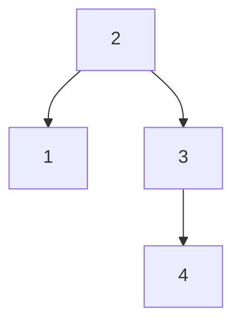
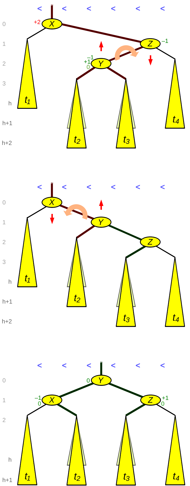

# AVL Tree

## Ziele

- [ ] Ich kennen den Unterschied zwischen einem unbalanced und balanced Tree
- [ ] Ich weiss, was ein AVLTree ist und verstehen seinen Balancing-Algorithmus
- [ ] Ich kann einen AVLTree implementieren

## Übersicht

* Self-balancing Binary-Search-Tree erfunden von Adelson-Velsky & Landis 1962 (russische Mathematiker) – älteste Datenstruktur für balancierte Bäume
* Ähnlich wie Binary Search Trees
    * Gleiche strukturelle Regeln
    * Suche und Iteration/Traversierung ist identisch
    * Einfügen und Löschen unterscheidet sich «nur» dadurch, dass zusätzlich ein Balance-Algorithmus angewendet wird (wenn nötig)
* Neue Konzepte 
    * Self-Balancing
    * Höhe
    * Balance Faktor
    * Rechts/Links lastig

## Balanced

### Balanced Binary Search Tree

* Der Baum bleibt balanciert, wenn Nodes eingefügt und gelöscht werden
    * O(log n) für Suche
* Für jeden Knoten gilt: Höhe des Left Childs weicht von der des Right Childs höchstens ±1 ab
* Beispiel
    * Einfügen der Werte 1, 2, 3, 4



### Balanced Einfügen und Löschen

* Einfügen ist identisch wie beim Binary Search Tree
    * Kleinerer Wert links
    * Grösserer oder gleicher Wert rechts
* Löschen ist identisch wie beim Binary Search Tree
    * Der zu löschende Node wird gesucht
    * Child-Nodes werden bezogen auf die drei Regeln verschoben
* Nach dem Einfügen und dem Löschen eines Nodes wird für jeden Parent-Node des gesamten Trees der Balance-Algorithmus ausgeführt

## Implementierung

* Klasse AVLTree entspricht fast der Klasse BinaryTree
    * Ausnahme: Beim Einfügen und Löschen wird der Balance-Algorithmus ausgeführt
* Klasse Node beinhaltet Funktionalität für Self-Balancing

## Balacing Algorithmus
* Für Balacing wird «Node-Rotation» verwendet
* Rotation wird beim Einfügen und Löschen ausgeführt
    * für den betreffenden Node und seine Parents
* Rotation ändert die physikalische Struktur des Trees damit diese wieder den Anforderungen eines Binary Search Trees entsprechen
* Rotation Algorithmen
    * Right Rotation
    * Left Rotation
    * Right-Left Rotation
    * Left-Right Rotation

## Welche Rotation?

* Tree rechts lastig
    * Wenn Right Child links lastig
        * Right-Left Rotation
    * Sonst
        * Left Rotation
* Tree links lastig
    * Wenn Left Child rechts lastig
        * Left-Right Rotation
    * Sonst
        * Right Rotation

```C#
internal void Balance() {
    if (State == TreeState.RightHeavy) {
        if (Right != null && Right.BalanceFactor < 0) {
            RightLeftRotation();
        } else {
            LeftRotation();
        }
    } else if (State == TreeState.LeftHeavy) {
        if (Left != null && Left.BalanceFactor > 0) {
            LeftRightRotation();
        } else {
            RightRotation();
        }
    }
}
```

### Right Rotation

* Algorithmus dreht einen Node nach rechts
    * Left Child wird neuer Root-Node
    * Right Child des neuen Root-Nodes wird Left Child des alten Root-Nodes
    * Alter Root-Node wird Right Child des neuen Root-Nodes
* Beispiel – Rotation nachdem «1» eingefügt wurde
    * Rechte Höhe von Node «4» ist 0
    * Linke Höhe von Node «4» ist 2
    * «2» wird neuer Root-Node
    * «4» wird Right Child von «2»
    * «3» wird Left Child von «4»


* Baum ist links-lastig --> Right Rotation
```
       4
      /
     2
    / \
   1  3
```

* 4 wird Right Child von 2

```
     2   4
    / \
   1  3
```

* 3 wird Left Child von 4
```
     2   4
    /   /
   1   3
```

* 4 wird Right Child von 2
```
     2
    / \
   1   4
      /
     3
```

### Left Rotation
* Algorithmus dreht einen Node nach links
    * Right Child wird neuer Root-Node
    * Left Child des neuen Root-Nodes wird Right Child des alten Root-Nodes
    * Alter Root-Node wird Left Child des neuen Root-Nodes
* Beispiel – Rotation nachdem «4» eingefügt wurde
    * Linke Höhe von Node «1» ist 0
    * Linke Höhe von Node «1» ist 2
    * «3» wird neuer Root-Node
    * «2» wird Right Child von «1»
    * «1» wird Left Child von «3»


* Baum ist rechts-lastig --> left Rotation
```
     1
      \
       3
      / \
     2   4
```

* 1 wird Linke Höhe von Node 1 ist 0
* 3 Wird neuer Root-Node
```
   1   3
      / \
     2   4
```

* 2 wird Right Child von 1
```
   1   3
    \   \
     2   4
```

* 1 wird Left Child von 3
```
       3
     /  \
    1    4
     \
      2
```


### Left-Right Rotation
* Right Rotation kann wiederum in einen unbalanced Tree resultieren
* Lösung
    * Left Rotation des Left Child
    * Right Rotation des aktualisierten Trees
* Beispiel
    * Left Rotation von «1»
    * Right Rotation von «3»


* Right Rotation dreht diesen Baum wieder ins unbalanced!
```
       3
     / 
    1    
     \
      2
```
* Nach Right Rotation
```
      1
       \
        3 
       /
      2
```

* Lösung --> Left Rotation und Right Rotation = Left-Right Rotation
* Beispiel
    * Left Rotation 1
    * Right Rotation 3

1. Select 1
```
       3
     / 
    1    
     \
      2
```
2. Left Rotation von 1
```
       3
     / 
    2    
   /
  1
```
3. Right Rotation von 3
```
    2    
   / \
  1   3
```

### Right-Left Rotation

* Left Rotation kann wiederum in einen unbalanced Tree resultieren
* Lösung
    * Right Rotation des Right Child
    * Left Rotation des aktualisierten Trees
* Beispiel
    * Right Rotation von «3»
    * Left Rotation von «1»


* Left Rotation kann wiederum in einen unbalanced Tree resultieren
```
      1
       \
        3 
       /
      2
```

* Select 3
```
      1
       \
        3 
       /
      2
```
* Right Rotation von 3
```
      1
       \
        2 
         \
          3
```
* Left Rotation von 1
```
    2    
   / \
  1   3
```

## Vom Binary-Tree zum AVL-Tree

!!! info

    AVL-Tree entspricht einem Binary Tree, welcher nach Add() sowie Remove() neu balanciert

## AVLTreeView

* Demo
* Verwendet «Microsoft Automatic Graph Layout» - diese Lib ist in der Lage, Graphen zu zeichnen 

https://github.com/Microsoft/automatic-graph-layout

https://en.wikipedia.org/wiki/Microsoft_Automatic_Graph_Layout

## Selbststudium
* AVLTree
    * https://en.wikipedia.org/wiki/AVL_tree
    * https://www.cs.usfca.edu/~galles/visualization/AVLtree.html
* Tree Rotation
    * https://en.wikipedia.org/wiki/Tree_rotation
* Binary Tree
    * https://en.wikipedia.org/wiki/Binary_tree


### Beispiel Rotationen

#### Einfache Rotation

* Right
* Left

```
      50
      / \
    17  76 
   / \  
  9  23 
```

* Ergebnis der Right Rotation
    * 23 gehört zu 50!

```
      17
      / \
    9   50
         / \
       23  76
```
#### Doppelte Rotation

* Right Left
* Left Right
* Right Right
* Left Left

[Doppelrotation](https://de.wikipedia.org/wiki/AVL-Baum#Doppelrotation)

```
      X
     /  \
    t1   Z
        / \
       Y  t4
      / \
    t2  t3
```

##### 1. Right Rotation zwischen Y und Z
```
      X
     /  \
    t1   Y
        / \
       t2   Z
           / \
         t3   t4
```

##### 2. Left Rotation zwischen X und Y
```
           Y
        /    \
       X      Z
      / \    / \
    t1  t2  t3  t4
```

Doppelrotation --> RechtsLinks(X, Z) = Rechts(Z) + Links(X)




### Balance Faktor (BF)

* Berechnung von unten nach Oben.

* Formel
    * Höhe (rechterteil Baum) - Höhe (linker Teilbaum)

#### Beispiel
```
           7
        /    \
       3      24
      /      / \
    2       15  42
```

* 2 = BF 0 --> da keine Kinder
* 15 = BF 0 --> da keine Kinder
* 42 = BF 0 --> da keine Kinder
* 24 = BF 0 --> 1 - 1 = 0
* 3 = BF -1  --> 0 - 1 = -1
* 7 = BF 0  --> 1 - 1 = 0

##### Einfügen von 1
```
           7
        /    \
       3      24
      /      / \
    2       15  42
   /
  1
```

--> BF neu berechnen

* 1 = BF 0 --> 1-1 = 0
* 2 = BF 0 --> 1-0 = -1
* 15 = BF 0 --> da keine Kinder
* 42 = BF 0 --> da keine Kinder
* 24 = BF 0 --> 1 - 1 = 0
* 3 = BF -2  --> 0 - 2 = -2  --> verletzt die AVL Tree regel --> +/-1
* 7 = BF -2  --> 2 - 3 = -1


##### Rechts Rotation
--> Rechtsrotation des verletzenden Knoten --> Knoten 3

```
           7
        /    \
       2      24
      / \     / \
    1    3   15  42
```

##### Links Rotation

* Löschen von 15
* Hinzfügen von 73

```
           7
        /    \
       2      24
      / \       \
    1    3       42
                  \
                  73
```

* BF 24 = 2 --> 2 - 0 = 2 --> verletzung der Regel +/-1

```
           7
        /    \
       2      42
      / \     / \
    1    3   24  73
```


##### Doppelrotation

* Löschen von 1 und 3
* Hinzufügen von 15

```
           7
        /    \
       2      42
              / \
             24  73
             /
            15
```

* --> unbalanced
* BF Knoten 7 = 3 - 1 = +2 --> verletzung der Regel
* BF Knoten 42 = 1 - 2 = -1

###### Rechts Links Rotation

1. Unter Knoten 42 ansehen und Rechts Rotation
```
           7
        /    \
       2      24
              / \
             15  42
                   \
                    73
```

2. Links Rotation
```
              24
           /   | \
          7   15  42
          /         \
        2          73
```

* !! Geht nicht da nur zwei Kinder möglich sind.
* Knoten 15 wird zu Right Child von 7

```
              24
           /     \
          7       42
         / \        \
        2   15       73
```

* Fertig


## Selbststudium
[AVL Baum Video](https://studyflix.de/informatik/avl-baum-1434)