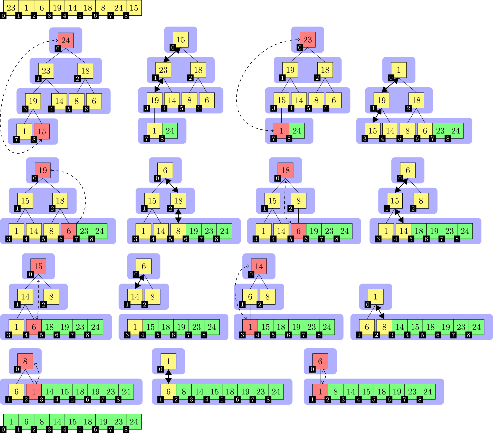

# Heapsort
Heapsort („Haldensortierung“) ist ein in den 1960ern von Robert W. Floyd und J. W. J. Williams entwickeltes Sortierverfahren. Seine Komplexität ist bei einem Array der Länge n in der Landau-Notation ausgedrückt in O ( n ⋅ log ⁡ n ) und ist damit asymptotisch optimal für Sortieren per Vergleich. Heapsort arbeitet zwar in-place, ist jedoch nicht stabil. Der Heapsort-Algorithmus verwendet einen binären Heap als zentrale Datenstruktur. Heapsort kann als eine Verbesserung von Selectionsort verstanden werden und ist mit Treesort verwandt. 

## Beschreibung

Die Eingabe ist ein Array mit zu sortierenden Elementen. Als erstes wird die Eingabe in einen binären Max-Heap überführt. Aus der Heap-Eigenschaft folgt direkt, dass nun an der ersten Array-Position das größte Element steht. Dieses wird mit dem letzten Array-Element vertauscht und die Heap-Array-Größe um 1 verringert, ohne den Speicher freizugeben. Die neue Wurzel des Heaps kann die Heap-Eigenschaft verletzen. Die Heapify-Operation korrigiert gegebenenfalls den Heap, so dass nun das nächstgrößere bzw. gleich große Element an der ersten Array-Position steht. Die Vertausch-, Verkleiner- und Heapify-Schritte werden so lange wiederholt, bis die Heap-Größe 1 ist. Danach enthält das Eingabe-Array die Elemente in aufsteigend sortierter Reihenfolge. In Pseudocode: 

## Pseudocode
```
heapsort(Array A)
  build(A)
  assert(isHeap(A, 0))
  tmp = A.size
  while (A.size > 1)
    A.swap(0, A.size - 1)
    A.size = A.size - 1
    heapify(A)
    assert(isHeap(A, 0))
  A.size = tmp
  assert(isSorted(A))
```
Bei einer Sortierung in absteigender Reihenfolge wird statt des Max-Heaps ein Min-Heap verwendet. In einem Min-Heap steht an erster Stelle das kleinste Element. Gemäß der Definition von einem binären Heap wird die Abfolge der Elemente in einem Heap durch eine Vergleichsoperation (siehe Ordnungsrelation) bestimmt, die eine totale Ordnung auf den Elementen definiert. In einem Min-Heap ist das die < {\displaystyle <}-Relation und in einem Max-Heap die > {\displaystyle >}-Relation. Der Pseudocode abstrahiert von der Vergleichsoperation.

Die zu sortierenden Elemente werden auch als Schlüssel bezeichnet. Pro Index-Position kann das Eingabe-Array mehrere Datenkomponenten enthalten. In dem Fall muss eine Komponente als Sortierschlüssel definiert werden, auf der die Vergleichsoperation arbeitet. Die Vertauschoperation vertauscht komplette Array-Einträge.

Die assert-Operation im Pseudocode dokumentiert, welche Eigenschaften das Array nach welchen Algorithmus-Schritten korrekterweise erfüllt bzw. erfüllen muss. 

## Beispiel



In der Abbildung wird die Sortierung der Beispielzahlenfolge

 23 1 6 19 14 18 8 24 15

mit dem Heapsort-Algorithmus dargestellt. Die einzelnen Teilbilder sind von links nach rechts und von oben nach unten chronologisch angeordnet. Im ersten Teilbild ist die unsortierte Eingabe und im letzten die sortierte Ausgabe abgebildet. Der Übergang vom ersten zum zweiten Teilbild entspricht der Heapifizierung des Eingabe-Arrays. Die an einer Swap-Operation beteiligten Elemente sind rot und mit unterbrochenen Pfeilen markiert, dicke Doppelpfeile bezeichnen die an einer Heapify-Operation beteiligten Elemente und grün markierte Elemente zeigen den schon sortierten Anteil des Arrays an. Die Element-Indizes sind mit kleinen schwarzen Knoten eingezeichnet, jeweils links unten von dem Element-Wert. Eine blaue Hinterlegung der Array-Elemente indiziert die Laufzeit der Heapsort-Prozedur.

Die Indizes entsprechen einer aufsteigenden Nummerierung nach Level-Order, beginnend mit 0. In einer Implementierung des Algorithmus ist die Baumstruktur implizit und das Array der Elemente zusammenhängend, was durch die Platzierung der Element-Indizes in der Abbildung angedeutet wird. 

## Vorteile:

* Asymptotisch optimale Komplexität: Heapsort hat eine Zeitkomplexität von O(n log n), was es asymptotisch optimal für Sortieralgorithmen macht, die auf Vergleichen basieren.
* In-Place-Sortierung: Der Algorithmus benötigt keinen zusätzlichen Speicherplatz für die Sortierung, da er in-place arbeitet. Dies bedeutet, dass die Sortierung direkt im ursprünglichen Array erfolgt.
* Worst-Case-Garantie: Heapsort hat eine garantierte Worst-Case-Laufzeit von O(n log n), was ihn in Szenarien mit vorsortierten Daten vorteilhaft macht, im Gegensatz zu anderen Algorithmen wie Quicksort, die im Worst Case O(n²) benötigen.
* Stabilität bei großen Datenmengen: Die Bottom-Up-Variante von Heapsort kann in bestimmten Fällen effizienter sein, insbesondere wenn die Vergleichsoperationen teuer sind.

## Nachteile:

* Instabilität: Heapsort ist nicht stabil, was bedeutet, dass die relative Reihenfolge von gleichen Elementen nicht garantiert bleibt. Dies kann in bestimmten Anwendungen problematisch sein.
* Langsame konstante Faktoren: In der Praxis ist Heapsort oft langsamer als andere Sortieralgorithmen wie Quicksort oder Introsort, insbesondere bei unsortierten oder teilweise vorsortierten Daten.
* Komplexität der Implementierung: Die Implementierung von Heapsort kann komplexer sein als die von einfacheren Algorithmen wie Selectionsort oder Insertion Sort.
* Höhere Anzahl an Vergleichen: Im Durchschnitt benötigt Heapsort mehr Vergleiche pro Element als einige andere Sortieralgorithmen, was zu einer schlechteren Leistung in der Praxis führen kann.

## Anwendung / Szenarien

### Große Datenmengen
Heapsort ist besonders geeignet für die Sortierung sehr großer Datenmengen, da er eine garantierte Laufzeit von O(n log n) bietet und in-place arbeitet, was den Speicherbedarf minimiert.

### Teure Vergleichsoperationen
Wenn die Vergleichsoperationen auf den zu sortierenden Daten relativ aufwendig sind, kann die Bottom-Up-Variante von Heapsort vorteilhaft sein, da sie im Durchschnitt weniger Vergleiche benötigt und somit effizienter arbeitet.

### Vorsortierte Daten
Heapsort ist vorteilhaft, wenn die Daten bereits teilweise vorsortiert sind, da er eine garantierte Worst-Case-Laufzeit von O(n log n) hat, im Gegensatz zu Algorithmen wie Quicksort, die in solchen Fällen schlechter abschneiden können.

### Stabilität der Laufzeit
In Anwendungen, in denen eine konsistente Laufzeit unabhängig von der Anordnung der Eingabedaten erforderlich ist, kann Heapsort eine gute Wahl sein, da er eine garantierte Laufzeit hat, die nicht von der spezifischen Datenanordnung abhängt.

### Vergleich mit anderen Algorithmen
Heapsort kann in Situationen eingesetzt werden, in denen andere Algorithmen wie Quicksort oder Introsort aufgrund ihrer schlechteren Worst-Case-Leistung (O(n²)) nicht geeignet sind, insbesondere wenn die Datenstruktur nicht optimal für diese Algorithmen ist.

## Komplexität

Effizienz

Man kann zeigen, dass der Aufbau des Heaps, in Landau-Notation ausgedrückt, in O ( n ) Schritten ablaufen kann. In einem großen, zufällig verteilten Datenfeld (100 bis 1010 Datenelemente) sind durchschnittlich mehr als 4, aber weniger als 5 signifikante Sortieroperationen pro Element nötig (2,5 Datenvergleiche und 2,5 Zuweisungen). Dies liegt daran, dass ein zufälliges Element mit exponentiell zunehmender Wahrscheinlichkeit einen geeigneten Vaterknoten findet (60 %, 85 %, 93 %, 97 %, …).

Die Heapify-Operation benötigt im ungünstigsten Fall Θ ( log ⁡ n ) Schritte. Dies ist bei exakt inverser Reihenfolge der Fall. In dem durchschnittlichen Fall werden etwa die Hälfte der Operationen des ungünstigsten Falls und somit ebenfalls Θ ( log ⁡ n ) Schritte benötigt. Günstig ist nur ein Feld, dessen Elemente fast alle den gleichen Wert haben. Sind aber nur weniger als ca. 80 % der Daten identisch, dann entspricht die Laufzeit bereits dem durchschnittlichen Fall. Eine vorteilhafte Anordnung von Daten mit mehreren verschiedenen Werten ist prinzipbedingt unmöglich, da dies der Heapcharakteristik widerspricht.

Den Worst Case stellen mit Θ ( n ⋅ log ⁡ n ) weitgehend vorsortierte Daten dar, weil der Heapaufbau de facto eine schrittweise vollständige Invertierung der Sortierreihenfolge darstellt. Der günstigste, aber unwahrscheinliche Fall ist ein bereits umgekehrt sortiertes Datenfeld (1 Vergleich pro Element, keine Zuweisung). Gleiches gilt, wenn fast alle Daten identisch sind.

Auf heterogenen Daten – vorsortiert oder nicht – dominiert Heapify mit wenigstens über 60 % der Zeit, meistens über 80 %. Somit garantiert Heapsort eine Gesamtlaufzeit von O ( n ⋅ log ⁡ n ). Auch im besten Fall wird eine Laufzeit von Θ ( n ⋅ log ⁡ n ) benötigt.

Eine Variante von Heapsort benötigt im Worst Case 

    n ⋅ log_{2} ⁡ ( n ) + n ⋅ log_{2} ⁡ ( log_{2} ⁡ ( n ) ) + n

_{Zahl} = tiefergestellt!

## Abgrenzung
Im Durchschnitt ist Heapsort nur dann schneller als Quicksort, wenn Vergleiche auf den zu sortierenden Daten sehr aufwendig sind und gleichzeitig eine für Quicksort ungünstige Datenanordnung besteht, z. B. viele gleiche Elemente. In der Praxis ist bei unsortierten oder teilweise vorsortierten Daten Quicksort oder Introsort um einen konstanten Faktor von 2 bis 5 schneller als Heapsort. Dies wird jedoch kontrovers diskutiert und es gibt Analysen, die Heapsort vorne sehen, sowohl aus Implementierungs- wie auch aus informationstheoretischen Überlegungen. Allerdings spricht das Worst-Case-Verhalten von O ( n ⋅ log ⁡ n ) gegenüber Θ ( n 2 ) bei Quicksort für Heapsort. Introsort ist dagegen in fast allen Fällen schneller als Heapsort, lediglich in entarteten Fällen 20 % bis 30 % langsamer. 

## Impelmentierung

```C#
using System;

class Heapsort
{
    public static void Heapsort(int[] A)
    {
        // Schritt 1: Erstelle einen Max-Heap
        BuildHeap(A);
        AssertIsHeap(A, 0);

        int tmp = A.Length; // Speichere die ursprüngliche Größe des Arrays

        // Schritt 2: Sortiere das Array
        while (A.Length > 1)
        {
            Swap(A, 0, A.Length - 1); // Vertausche das größte Element mit dem letzten Element
            Array.Resize(ref A, A.Length - 1); // Verringere die Größe des Arrays
            Heapify(A); // Stelle den Heap wieder her
            AssertIsHeap(A, 0);
        }

        // Stelle die ursprüngliche Größe des Arrays wieder her (optional, je nach Bedarf)
        Array.Resize(ref A, tmp);
        AssertIsSorted(A);
    }

    private static void BuildHeap(int[] A)
    {
        int n = A.Length;
        for (int i = n / 2 - 1; i >= 0; i--)
        {
            Heapify(A, n, i);
        }
    }

    private static void Heapify(int[] A, int n, int i)
    {
        int largest = i;
        int left = 2 * i + 1;
        int right = 2 * i + 2;

        if (left < n && A[left] > A[largest])
        {
            largest = left;
        }

        if (right < n && A[right] > A[largest])
        {
            largest = right;
        }

        if (largest != i)
        {
            Swap(A, i, largest);
            Heapify(A, n, largest);
        }
    }

    private static void Swap(int[] A, int a, int b)
    {
        int temp = A[a];
        A[a] = A[b];
        A[b] = temp;
    }

    private static void AssertIsHeap(int[] A, int index)
    {
        // Hier könnte eine Implementierung zur Überprüfung der Heap-Eigenschaft stehen
        // Diese Methode ist nur ein Platzhalter
    }

    private static void AssertIsSorted(int[] A)
    {
        // Hier könnte eine Implementierung zur Überprüfung der Sortierung stehen
        // Diese Methode ist nur ein Platzhalter
    }

    // Hauptprogramm zum Testen des Heapsort-Algorithmus
    public static void Main(string[] args)
    {
        int[] array = { 23, 1, 6, 19, 14, 18, 8, 24, 15 };
        Console.WriteLine("Unsortiertes Array:");
        Console.WriteLine(string.Join(", ", array));

        Heapsort(array);

        Console.WriteLine("Sortiertes Array:");
        Console.WriteLine(string.Join(", ", array));
    }
}
```

### Impelmentierung Bottom-Up-Heapsort

```C#
using System;

class Heapsort
{
    public static int HeapsortBu(int[] data, int n) // zu sortierendes Feld und seine Länge
    {
        int val, parent, child;
        int root = n >> 1; // erstes Blatt im Baum
        int count = 0; // Zähler für Anzahl der Vergleiche

        while (true)
        {
            if (root > 0) // Teil 1: Konstruktion des Heaps
            {
                parent = --root;
                val = data[root]; // zu versickernder Wert
            }
            else if (--n > 0) // Teil 2: eigentliche Sortierung
            {
                val = data[n]; // zu versickernder Wert vom Heap-Ende
                data[n] = data[0]; // Spitze des Heaps hinter den Heap in den sortierten Bereich verschieben
                parent = 0; // zurück zur Wurzel
            }
            else // Heap ist leer; Sortierung beendet
            {
                break;
            }

            while ((child = (parent + 1) << 1) < n) // zweites Kind; Abbruch am Ende des Heaps
            {
                if (++count, data[child - 1] > data[child]) // größeres Kind wählen
                    --child;

                data[parent] = data[child]; // größeres Kind nach oben rücken
                parent = child; // in der Ebene darunter weitersuchen
            }

            if (child == n) // ein einzelnes Kind am Heap-Ende ist übersprungen worden
            {
                if (++count, data[--child] >= val) // größer als der zu versickernde Wert
                {
                    data[parent] = data[child]; // noch nach oben
                    data[child] = val; // versickerten Wert eintragen
                    continue;
                }

                child = parent; // 1 Ebene nach oben zurück
            }
            else
            {
                if (++count, data[parent] >= val) // das Blatt ist größer als der zu versickernde Wert
                {
                    data[parent] = val; // direkt eintragen
                    continue; // direkt eintragen
                }

                child = (parent - 1) >> 1; // 2 Ebenen nach oben zurück
            }

            while (child != root) // maximal zum Ausgangspunkt zurück
            {
                parent = (child - 1) >> 1; // den Vergleichswert haben wir bereits nach oben verschoben
                if (++count, data[parent] >= val) // größer als der zu versickernde Wert
                    break; // Position gefunden

                data[child] = data[parent]; // Rückverschiebung nötig
                child = parent; // 1 Ebene nach oben zurück
            }

            data[child] = val; // versickerten Wert eintragen
        }

        return count; // Anzahl der Vergleiche zurückgeben
    }

    // Hauptprogramm zum Testen des Heapsort-Algorithmus
    public static void Main(string[] args)
    {
        int[] array = { 23, 1, 6, 19, 14, 18, 8, 24, 15 };
        Console.WriteLine("Unsortiertes Array:");
        Console.WriteLine(string.Join(", ", array));

        int comparisons = HeapsortBu(array, array.Length);

        Console.WriteLine("Sortiertes Array:");
        Console.WriteLine(string.Join(", ", array));
        Console.WriteLine($"Anzahl der Vergleiche: {comparisons}");
    }
}
```

### Implementierung Wikibooks

```C#
//Die Implementierung wurde der JAVA-Version nachempfunden

/// <summary>
/// sortiert ein Array mit heapsort
/// </summary>
/// <param name="a">Das Array</param>
/// <remarks></remarks>
private void heapSort(ref int[] a)
{
	generateMaxHeap(a);

	//hier wird sortiert
	for (int i = a.Length - 1; i > 0; i += -1) {
		vertausche(a, i, 0);
		versenke(a, 0, i);
	}

}

/// <summary>
/// Erstellt einen MaxHeap Baum im Array
/// </summary>
/// <param name="a">das array</param>
/// <remarks></remarks>
private void generateMaxHeap(int[] a)
{
	//starte von der Mitte rückwärts.
	for (int i = (int)(a.Length / 2 - 1); i >= 0; i += -1) {
		versenke(a, i, a.Length);
	}
}

/// <summary>
/// versenkt ein element im baum
/// </summary>
/// <param name="a">Das Array</param>
/// <param name="i">Das zu versenkende Element</param>
/// <param name="n">Die letzte Stelle im Baum die beachtet werden soll</param>
/// <remarks></remarks>
private void versenke(int[] a, int i, int n)
{
	while (i <= (n / 2 - 1)) {
		int kindIndex = (i + 1) * 2 - 1;
		//berechnet den Index des linken kind

		//bestimme ob ein rechtes Kind existiert
		if (kindIndex + 1 <= n - 1) {
			//rechtes kind existiert
			if (a[kindIndex] < a[kindIndex + 1])
				kindIndex += 1;
			//wenn rechtes kind größer ist nimm das 

		}

		//teste ob element sinken muss 
		if (a[i] < a[kindIndex]) {
			vertausche(a, i, kindIndex);
			i = kindIndex;
		} else { break; }
		

	}
}

/// <summary>
/// Vertauscht die arraypositionen von i und kindIndex
/// </summary>
/// <param name="a">a Das Array in dem getauscht wird</param>
/// <param name="i">i der erste index</param>
/// <param name="kindIndex">kindIndex der 2. index</param>
/// <remarks></remarks>
private void vertausche(int[] a, int i, int kindIndex)
{
	int z = a[i];
	a[i] = a[kindIndex];
	a[kindIndex] = z;
}
```

## Link

* [https://de.wikipedia.org/wiki/Heapsort](https://de.wikipedia.org/wiki/Heapsort)
* [https://studyflix.de/informatik/heapsort-1326](https://studyflix.de/informatik/heapsort-1326)
* [Wikibooks](https://de.wikibooks.org/wiki/Algorithmensammlung:_Sortierverfahren:_Heapsort#C#)