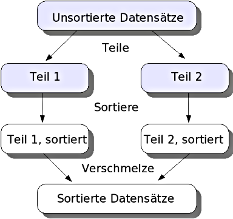

# Mergesort

## Prinzip



```
funktion mergesort(liste);
  falls (Größe von liste <= 1) dann antworte liste
  sonst
     halbiere die liste in linkeListe, rechteListe
     linkeListe = mergesort(linkeListe)
     rechteListe = mergesort(rechteListe)
     antworte merge(linkeListe, rechteListe)
```
```
funktion merge(linkeListe, rechteListe);
  neueListe
  solange (linkeListe und rechteListe nicht leer)
       falls (erstes Element der linkeListe <= erstes Element der rechteListe)
       dann füge erstes Element linkeListe in die neueListe hinten ein und entferne es aus linkeListe
       sonst füge erstes Element rechteListe in die neueListe hinten ein und entferne es aus rechteListe
  solange_ende
  solange (linkeListe nicht leer)
       füge erstes Element linkeListe in die neueListe hinten ein und entferne es aus linkeListe
  solange_ende
  solange (rechteListe nicht leer)
       füge erstes Element rechteListe in die neueListe hinten ein und entferne es aus rechteListe
  solange_ende
  antworte neueListe
```

## Vorteile

* Stabile Sortierung: Mergesort ist ein stabiler Sortieralgorithmus, was bedeutet, dass die relative Reihenfolge von gleichen Elementen beibehalten wird. Dies ist besonders wichtig in Anwendungen, bei denen die Stabilität der Sortierung erforderlich ist.

* Effiziente Zeitkomplexität: Die Zeitkomplexität von Mergesort beträgt O(n log n) in allen Fällen (Worst-, Best- und Average-Case). Dies macht ihn hinsichtlich der Komplexität Quicksort überlegen, insbesondere da Quicksort im Worst-Case eine Komplexität von Θ(n²) aufweist.

* Geeignet für große Datenmengen: Mergesort kann effizient mit großen Datenmengen umgehen, da er auch auf externen Speichermedien gut funktioniert. Dies ist besonders vorteilhaft, wenn die Daten nicht vollständig im Hauptspeicher gehalten werden können.

* Rekursive Struktur: Die rekursive Natur von Mergesort ermöglicht eine klare und elegante Implementierung, die leicht zu verstehen ist. Die Aufteilung der Daten in kleinere Teillisten und deren anschließende Zusammenführung ist intuitiv.

* Korrektheit und Terminierung: Der Rekursionsabbruch stellt sicher, dass der Algorithmus terminieren kann, und die Korrektheit wird durch die strukturierte Zusammenführung der sortierten Teillisten gewährleistet.

## Nachteile

* Zusätzlicher Speicherbedarf: Mergesort benötigt zusätzlichen Speicherplatz, um die temporären Arrays für die Zusammenführung zu speichern, was O(n) an zusätzlichem Speicher erfordert. Dies kann bei großen Datenmengen problematisch sein, da es nicht als In-place-Verfahren gilt.

* Langsame Ausführung für kleine Datensätze: Für kleine Datensätze kann Mergesort langsamer sein als einfachere Algorithmen wie Insertion Sort oder Selection Sort, da der Overhead für das Teilen und Zusammenführen nicht gerechtfertigt ist.

* Komplexität der Implementierung: Obwohl die rekursive Struktur von Mergesort klar ist, kann die Implementierung des Merge-Schrittes komplex sein, insbesondere wenn man die Stabilität und Effizienz im Auge behalten möchte.

* Nicht in-place bei Arrays: Mergesort arbeitet in der Regel nicht in-place bei Arrays, was bedeutet, dass zusätzliche Datenstrukturen benötigt werden, um die Sortierung durchzuführen. Dies kann die Effizienz in Bezug auf den Speicherverbrauch beeinträchtigen.

## Anwendung

## Einsatzbereiche

* Große Datenmengen: Mergesort eignet sich besonders gut für die Sortierung großer Datenmengen, insbesondere wenn die Daten nicht vollständig im Hauptspeicher gehalten werden können. Dies macht ihn ideal für Anwendungen, die mit externen Speichermedien arbeiten.

* Stabile Sortierung erforderlich: In Anwendungen, bei denen die relative Reihenfolge von gleichen Elementen beibehalten werden muss, ist Mergesort aufgrund seiner stabilen Sortierung von Vorteil. Dies ist wichtig in Bereichen wie Datenbanken oder bei der Verarbeitung von Datensätzen, in denen die Sortierung auf bestimmten Attributen erfolgt.

* Rekursive Algorithmen: Mergesort ist ein gutes Beispiel für einen rekursiven Algorithmus, der das Prinzip "teile und herrsche" anwendet. Dies macht ihn zu einem Lehrbeispiel in der Informatik, um rekursive Denkweisen und Algorithmen zu vermitteln.

* Parallelverarbeitung: Aufgrund seiner Struktur lässt sich Mergesort gut parallelisieren, was ihn für moderne Mehrkernprozessoren geeignet macht. Dies kann die Effizienz bei der Verarbeitung großer Datenmengen weiter steigern.

## Abgrenzung

* Vergleich mit Quicksort: Mergesort hat eine bessere Worst-Case-Zeitkomplexität (O(n log n)) im Vergleich zu Quicksort, der im Worst-Case eine Komplexität von Θ(n²) aufweist. Dies macht Mergesort in Szenarien, in denen die Worst-Case-Leistung entscheidend ist, überlegen.

* Speicherbedarf: Mergesort benötigt zusätzlichen Speicherplatz (O(n)), was ihn von In-place-Sortieralgorithmen wie Quicksort oder Heapsort abgrenzt, die keinen zusätzlichen Speicher benötigen. Dies kann in speicherbeschränkten Umgebungen ein Nachteil sein.

* Eignung für kleine Datensätze: Für kleine Datensätze kann Mergesort ineffizienter sein als einfachere Sortieralgorithmen wie Insertion Sort oder Selection Sort, da der Overhead für das Teilen und Zusammenführen nicht gerechtfertigt ist. In solchen Fällen sind diese einfacheren Algorithmen oft schneller.

## Impelementierung

```C#
using System;

class Program
{
    static void Main(string[] args)
    {
        int[] array = { 38, 27, 43, 3, 9, 82, 10 };
        Console.WriteLine("Unsortiertes Array:");
        Console.WriteLine(string.Join(", ", array));

        Mergesort(array, 0, array.Length - 1);

        Console.WriteLine("Sortiertes Array:");
        Console.WriteLine(string.Join(", ", array));
    }

    static void Mergesort(int[] array, int left, int right)
    {
        if (left < right)
        {
            // Finde die Mitte des Arrays
            int middle = (left + right) / 2;

            // Rekursiv die beiden Hälften sortieren
            Mergesort(array, left, middle);
            Mergesort(array, middle + 1, right);

            // Die beiden Hälften zusammenführen
            Merge(array, left, middle, right);
        }
    }

    static void Merge(int[] array, int left, int middle, int right)
    {
        // Die Größe der beiden Teilarrays bestimmen
        int n1 = middle - left + 1;
        int n2 = right - middle;

        // Temporäre Arrays erstellen
        int[] leftArray = new int[n1];
        int[] rightArray = new int[n2];

        // Daten in die temporären Arrays kopieren
        for (int i = 0; i < n1; i++)
            leftArray[i] = array[left + i];
        for (int j = 0; j < n2; j++)
            rightArray[j] = array[middle + 1 + j];

        // Indizes für die temporären Arrays und das Hauptarray
        int k = left;
        int iIndex = 0;
        int jIndex = 0;

        // Die beiden Teilarrays zusammenführen
        while (iIndex < n1 && jIndex < n2)
        {
            if (leftArray[iIndex] <= rightArray[jIndex])
            {
                array[k] = leftArray[iIndex];
                iIndex++;
            }
            else
            {
                array[k] = rightArray[jIndex];
                jIndex++;
            }
            k++;
        }

        // Die verbleibenden Elemente des linken Arrays hinzufügen
        while (iIndex < n1)
        {
            array[k] = leftArray[iIndex];
            iIndex++;
            k++;
        }

        // Die verbleibenden Elemente des rechten Arrays hinzufügen
        while (jIndex < n2)
        {
            array[k] = rightArray[jIndex];
            jIndex++;
            k++;
        }
    }
}
```


## Links

* [https://de.wikipedia.org/wiki/Mergesort](https://de.wikipedia.org/wiki/Mergesort)
* [https://studyflix.de/informatik/mergesort-1324](https://studyflix.de/informatik/mergesort-1324)
* [Wikibooks](https://de.wikibooks.org/wiki/Algorithmensammlung:_Sortierverfahren:_Mergesort)