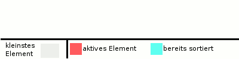

# Selectionsort



* einfach
* instabil
* "Sortieren nach direktes Auswählen"
    * kleinste oder grösste Element
        * minSort
        * maxSort
* Keine Unterschiede im Best Case oder Worst Case

Formel der Anzahl Vergleiche = n (n-1)/2

## Beschreibung
Selectionsort (englisch selection ‚Auswahl‘ und englisch sort ‚sortieren‘) ist ein einfacher („naiver“) Sortieralgorithmus, der in-place arbeitet und in seiner Grundform instabil ist, wobei er sich auch stabil implementieren lässt. Die Komplexität von Selectionsort ist O ( n 2 ) (Landau-Notation). Alternative Bezeichnungen des Algorithmus sind MinSort (von Minimum) bzw. MaxSort (von Maximum), Selectsort oder ExchangeSort (AustauschSort). 

## Prinzip
Sei S der sortierte Teil des Arrays (vorne im Array) und U der unsortierte Teil (dahinter). Am Anfang ist S noch leer, U entspricht dem ganzen (restlichen) Array. Das Sortieren durch Auswählen läuft nun folgendermaßen ab:

Suche das kleinste Element in U und vertausche es mit dem ersten Element von U (= das erste Element nach S).

Danach ist das Array bis zu dieser Position sortiert. Das kleinste Element wird in S verschoben (indem S einfach als ein Element länger betrachtet wird, und U nun ein Element später beginnt). S ist um ein Element gewachsen, U um ein Element kürzer geworden. Anschließend wird das Verfahren so lange wiederholt, bis das gesamte Array abgearbeitet worden ist; S umfasst am Ende das gesamte Array, aufsteigend sortiert, U ist leer.

### Alternativen

Analog kann statt des kleinsten Elements das größte in U gesucht werden, was zu einer absteigenden Sortierreihenfolge führt. Auch kann U nach vorne und S nach hinten gelegt werden, was ebenfalls die Sortierreihenfolge umkehrt.

Zudem existieren auch Ansätze, in denen beide Varianten (MinSort und MaxSort) gemeinsam arbeiten; es gibt einen S-Bereich vorne und einen S-Bereich hinten, U liegt dazwischen. Während eines Durchlaufes werden das größte und das kleinste Element in U gesucht und dieses dann jeweils an den Anfang bzw. an das Ende von U gesetzt. Dadurch erreicht man in der Regel eine Beschleunigung, die jedoch meist nicht den Faktor 2 erreicht. Diese Variante wird gelegentlich „Optimized Selection Sort Algorithm“ (OSSA) genannt. 

## Vorteile

* Einfachheit: Selection Sort ist leicht zu verstehen und zu implementieren, was ihn zu einem guten Lehrwerkzeug für grundlegende Sortierkonzepte macht.
* In-Place-Sortierung: Der Algorithmus benötigt nur eine konstante Menge an zusätzlichem Speicher (O(1)), da die Sortierung direkt im ursprünglichen Array erfolgt.
* Flexibilität: Der Algorithmus kann leicht angepasst werden, um entweder aufsteigend oder absteigend zu sortieren, indem man entweder das kleinste oder das größte Element auswählt.
* Stabilität: Obwohl der Standard-Selection Sort instabil ist, kann er so implementiert werden, dass er stabil ist, was bedeutet, dass die Reihenfolge gleichwertiger Elemente erhalten bleibt.

## Nachteile

* Ineffizienz: Die Zeitkomplexität von O(n²) macht den Algorithmus für große Datensätze ineffizient, da die Anzahl der Vergleiche und Tauschoperationen mit der Größe des Arrays quadratisch ansteigt.
* Langsame Leistung: Im Vergleich zu effizienteren Sortieralgorithmen wie Quicksort oder Mergesort ist Selection Sort in der Regel langsamer, insbesondere bei größeren Listen.
* Wenig Anpassungsfähigkeit: Der Algorithmus ist nicht adaptiv, was bedeutet, dass er nicht erkennt, wenn die Liste bereits teilweise sortiert ist, und dennoch die gleichen Schritte ausführt.
* Hohe Anzahl an Vergleichen: Selbst im besten Fall benötigt der Algorithmus eine große Anzahl an Vergleichen (n * (n - 1) / 2), was seine Effizienz weiter einschränkt.

## Anwendungen

### Einsatzbereiche:

* Lehrzwecke: Aufgrund seiner Einfachheit und der klaren Struktur eignet sich Selection Sort hervorragend als Einführung in Sortieralgorithmen in der Informatik-Ausbildung.
* Kleine Datensätze: Bei sehr kleinen Arrays oder Listen kann Selection Sort aufgrund des geringen Overheads und der einfachen Implementierung eine akzeptable Leistung bieten.
* Eingeschränkte Ressourcen: In Umgebungen mit sehr begrenztem Speicher (z. B. eingebettete Systeme) kann Selection Sort vorteilhaft sein, da er in-place arbeitet und nur eine konstante Menge an zusätzlichem Speicher benötigt.
* Stabilität: Wenn eine stabile Sortierung erforderlich ist und die Liste klein ist, kann eine angepasste Version von Selection Sort verwendet werden.

### Abgrenzung

* Vergleich mit anderen Sortieralgorithmen: Im Vergleich zu effizienteren Algorithmen wie Quicksort, Mergesort oder Heapsort ist Selection Sort in der Regel langsamer, insbesondere bei größeren Datensätzen. Diese Algorithmen haben eine bessere durchschnittliche und worst-case Zeitkomplexität (O(n log n)).
* Nicht adaptiv: Selection Sort ist nicht adaptiv, was bedeutet, dass er nicht von bereits sortierten oder teilweise sortierten Daten profitiert. Algorithmen wie Insertion Sort sind in solchen Fällen effizienter.
* Instabilität: In seiner Standardform ist Selection Sort instabil, was bedeutet, dass die relative Reihenfolge gleichwertiger Elemente nicht garantiert ist. Für Anwendungen, bei denen die Stabilität wichtig ist, sind andere Algorithmen wie Mergesort oder eine angepasste Version von Insertion Sort besser geeignet.
* Einsatz in der Praxis: In der Praxis wird Selection Sort selten verwendet, da es in den meisten realen Anwendungen effizientere Alternativen gibt. Er wird hauptsächlich in speziellen Fällen oder zu Bildungszwecken eingesetzt.

## Pseudocode

```
prozedur SelectionSort( A : Liste sortierbarer Elemente )
  hoechsterIndex = Elementanzahl( A ) - 1
  einfuegeIndex = 0
  wiederhole
    minPosition = einfuegeIndex
    für jeden idx von (einfuegeIndex + 1) bis hoechsterIndex wiederhole
      falls A[ idx ] < A[ minPosition ] dann
          minPosition = idx
      ende falls
    ende für
    vertausche A[ minPosition ] und A[ einfuegeIndex ]
    einfuegeIndex = einfuegeIndex + 1
  solange einfuegeIndex < hoechsterIndex
prozedur ende
```

## Beispiel
Es soll ein Array mit dem Inhalt [ 4 | 2 | 1 | 6 | 3 | 5 ] sortiert werden. Rot eingefärbte Felder deuten eine Tauschoperation an, blau eingefärbte Felder liegen im bereits sortierten Teil des Arrays.

<font color="red">4</font> 2 <font color="red">1</font> 6 	3 	5

Das Minimum ist 1. Vertausche also das 1. und das 3. Element.

<font color="blue">1</font>	<font color="red">2</font>	4 	6 	3 	5

Das Minimum des rechten Teilarrays ist 2. Da es bereits an 2. Position steht, wird es nicht getauscht.

<font color="blue">1 	2</font> <font color="red">4</font> 6 <font color="red">3</font> 5

Wir haben jetzt bereits ein sortiertes Teilarray der Länge 2. Wir vertauschen nun 4 und das Minimum 3.

<font color="blue">1 	2 	3</font> <font color="red">6 4</font> 5

Wir vertauschen 6 und 4.

<font color="blue">1 	2 	3 	4</font> <font color="red">6 5</font>

Wir vertauschen 6 und 5.

<font color="blue">1 	2 	3 	4 	5 	6</font>

Das Array ist jetzt fertig sortiert. 

## Komplexität
Um ein Array mit n Einträgen mittels SelectionSort zu sortieren, muss n−1-mal das Minimum bestimmt und ebenso oft getauscht werden.

Bei der ersten Bestimmung des Minimums sind n − 1 Vergleiche notwendig, bei der zweiten n − 2 Vergleiche usw.

Mit der gaußschen Summenformel erhält man die Anzahl der notwendigen Vergleiche:

    (n−1)+(n−2)+...+3+2+1 = (n−1)*n/2 = (n^2/2)-(n/2)

Da das erste Element n − 1 ist, entspricht die exakte Schrittzahl nicht genau der Darstellung der Gaußformel n+(n−1)+...+2+1=n*(n+1)/2.

SelectionSort liegt somit in der Komplexitätsklasse O(n^2).

Da zum Ermitteln des Minimums immer der komplette noch nicht sortierte Teil des Arrays durchlaufen werden muss, benötigt SelectionSort auch im „besten Fall“ n*(n−1)/2 Vergleiche. 

## Implementierung

```C#
static void SelectionSort(ref List<int> feld)
{
    // alle Zahlen durchlaufen
    for (int i = 0; i < feld.Count; i++)
    {
        // Position min der kleinsten Zahl ab Position i suchen
        int min = i;
        for (int j = i + 1; j < feld.Count; j++)
        {
            if (feld[j] < feld[min])
            {    
              min = j;
            }
        }
        // Zahl an Position i mit der kleinsten Zahl vertauschen
        int tmp = feld[min];
        feld[min] = feld[i];
        feld[i] = tmp;
    }
}
```

## Links

* [Wikiepdia Selectionsort](https://de.wikipedia.org/wiki/Selectionsort)
* [https://studyflix.de/informatik/selectionsort-1323](https://studyflix.de/informatik/selectionsort-1323)
* [Wikibooks](https://de.wikibooks.org/wiki/Algorithmensammlung:_Sortierverfahren:_Selectionsort)