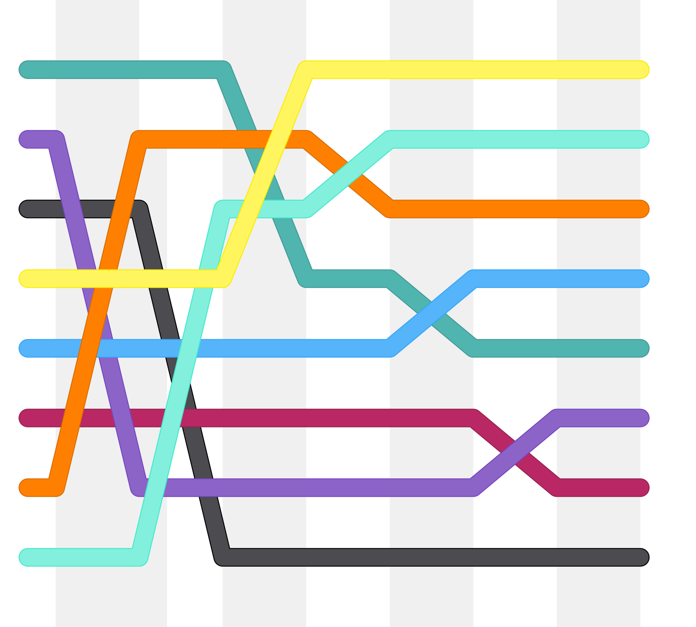

# Shellsort



* Instabil
* In-Place
* Basiert auf den Insertionsort

* Listengrösse (Anzahl der Elemente) wird defineirt
    * Bspw. 4, 2, 1 für die Iterationen

* Komplexität
    * O(n^2)

## Beschreibung
Shellsort ist ein von Donald L. Shell im Jahr 1959 entwickeltes Sortierverfahren, das auf dem Sortierverfahren des direkten Einfügens (Insertionsort) basiert. 

## Prinzip
Der Grundgedanke besteht darin, die unsortierte Folge so umzuordnen, dass man eine sortierte Teilfolge enthält, wenn man jedes h-te Element entnimmt. Das soll für jedes beliebige Anfangsfeld gelten.

Der Algorithmus von Shellsort setzt diese Idee um, indem er die unsortierte Folge in mehrere Teilfolgen aufteilt und danach die Einträge innerhalb jeder Teilfolge sortiert. Beispielsweise führt eine Aufteilung in 4 Teilfolgen zu einer Teilfolge mit den Indizes 0, 4, 8, … einer anderen mit den Indizes 1, 5, 9, … und so weiter. Nach einem solchen Sortierschritt nennt man die Folge 4-sortiert.

Shellsort wiederholt mehrere Sortierschritte. Der erste Sortierschritt erzeugt die meisten Teilfolgen, also auch den größten Abstand zwischen den Indizes einer Teilfolge. Der Abstand wird mit jedem Schritt kleiner. Wenn z. B. Shellsort mit Abstand 4 anfängt, dann wird die Folge erst 4-sortiert, dann 2-sortiert, und zuletzt mit normalem Insertionsort sozusagen 1-sortiert.

Anschaulich wäre dies anhand von Hilfsmatrizen darzustellen (siehe Beispiel):

* Die Daten werden in eine k-spaltige Matrix zeilenweise geschrieben
* Die Spalten der Matrix werden einzeln sortiert

Daraus resultiert eine grobe Sortierung. Dieser Schritt wird mehrmals wiederholt, wobei jeweils die Breite der Matrix verringert wird, bis die Matrix nur noch aus einer einzigen vollständig sortierten Spalte besteht.

Eine a*b-sortierte Sequenz ist nicht auch automatisch a-sortiert oder b-sortiert. Zum Beweis betrachten wir eine Sequenz aus den Zahlen 1 bis 12. Diese ist 6-sortiert, wenn wir auf eine beliebige Permutation der Zahlen 1, 2, 3, 4, 5, 6 eine ebenfalls beliebige Permutation der Zahlen 7, 8, 8, 10, 11, 12 folgen lassen. Die Permutation 6, 5, 4, 3, 2, 1 ist aber keinesfalls 2- oder 3-sortiert. 6, 5, 4, 3, 2, 1, 7, 8, 9, 10, 11, 12 ist 6-sortiert, aber nicht 2- und auch nicht 3-sortiert.

Shellsort arbeitet in-place, gehört jedoch nicht zu den stabilen Sortieralgorithmen. Aufgrund der Sortierung über Distanz verliert die Sortiermethode ihre Eigenschaft „stabil“. Zwei benachbarte und sortierte Elemente landen in verschiedenen Untersequenzen und werden möglicherweise so umsortiert, dass ihre Reihenfolge vertauscht wird. 

## Vorteile

* Effiziente Vorab-Sortierung: Durch die Aufteilung der unsortierten Folge in Teilfolgen und die schrittweise Sortierung mit abnehmenden Abständen wird eine grobe Sortierung erreicht, die die nachfolgenden Sortierschritte erleichtert.

* In-Place-Sortierung: Shellsort benötigt nur einen minimalen zusätzlichen Speicherplatz, da die Sortierung direkt im Originalarray erfolgt.

* Reduzierte Verschiebungen: Im Vergleich zu einem normalen Insertionsort müssen die Elemente nicht so weit verschoben werden, was die Effizienz bei der Sortierung verbessert.

* Flexibilität bei der Gap-Sequenz: Die Möglichkeit, verschiedene Gap-Sequenzen zu verwenden, ermöglicht eine Anpassung an spezifische Datensätze, was die Leistung optimieren kann.

* Einfachheit der Implementierung: Die Implementierung von Shellsort ist relativ unkompliziert und erfordert nicht viel Code.

## Nachteile

* Nicht stabil: Shellsort ist kein stabiler Sortieralgorithmus. Die Sortierung über Distanz kann dazu führen, dass benachbarte Elemente in der Reihenfolge vertauscht werden.

* Schlechtere Worst-Case-Leistung: Im schlimmsten Fall kann die Laufzeit von Shellsort O(n^2) betragen, was im Vergleich zu effizienteren Algorithmen wie Quicksort oder Mergesort ungünstig ist.

* Abhängigkeit von der Gap-Sequenz: Die Wahl der Gap-Sequenz hat einen erheblichen Einfluss auf die Leistung. Eine suboptimale Wahl kann die Effizienz stark beeinträchtigen.

* Komplexität der Analyse: Die Analyse der Laufzeit von Shellsort ist komplex und variiert je nach gewählter Gap-Sequenz, was es schwierig macht, eine allgemeine Aussage über die Leistung zu treffen.

* Praktische Ineffizienz der ursprünglichen Gap-Sequenz: Die von Shell ursprünglich vorgeschlagene Schrittfolge (1, 2, 4, 8, 16, ...) hat sich in der Praxis als nicht optimal erwiesen, da sie nur gerade Stellen sortiert und ungerade Stellen erst im letzten Schritt behandelt.


## Anwendung

## Einsatzbereiche von Shellsort:

* Kleine bis mittelgroße Datensätze: Shellsort eignet sich gut für die Sortierung von kleinen bis mittelgroßen Datenmengen, da die Implementierung einfach ist und der Algorithmus in der Regel schneller als einfachere Sortieralgorithmen wie Insertion Sort oder Bubble Sort arbeitet.

* Fast sortierte Daten: Der Algorithmus zeigt eine besonders gute Leistung, wenn die Daten bereits teilweise sortiert sind. In solchen Fällen kann die Laufzeit erheblich reduziert werden.

* In-Place-Sortierung: Da Shellsort in-place arbeitet und nur einen minimalen zusätzlichen Speicher benötigt, ist er nützlich in Umgebungen, in denen der Speicher begrenzt ist.

* Einfache Implementierung: Aufgrund der relativ einfachen Implementierung kann Shellsort in Anwendungen eingesetzt werden, in denen eine schnelle und unkomplizierte Sortierlösung benötigt wird.

## Abgrenzung von Shellsort:

* Nicht stabil: Shellsort ist kein stabiler Sortieralgorithmus, was bedeutet, dass die relative Reihenfolge von gleichen Elementen nicht garantiert ist. Dies kann in Anwendungen problematisch sein, in denen die Stabilität der Sortierung wichtig ist.

* Schlechtere Worst-Case-Leistung: Im Vergleich zu effizienteren Algorithmen wie Quicksort oder Mergesort hat Shellsort im schlimmsten Fall eine Laufzeit von O(n^2). Daher ist er nicht die beste Wahl für sehr große Datensätze oder in Situationen, in denen die Leistung entscheidend ist.

* Abhängigkeit von der Gap-Sequenz: Die Leistung von Shellsort hängt stark von der Wahl der Gap-Sequenz ab. Eine suboptimale Wahl kann die Effizienz des Algorithmus erheblich beeinträchtigen, was ihn weniger flexibel macht als einige andere Sortieralgorithmen.

* Einsatz in speziellen Anwendungen: Shellsort wird oft in speziellen Anwendungen eingesetzt, wo die oben genannten Einschränkungen akzeptabel sind, und wo die Vorteile der In-Place-Sortierung und der einfachen Implementierung überwiegen

## Beispiel

Zu sortieren sind die Zahlen 2, 5, 3, 4, 3, 9, 3, 2, 5, 4, 1, 3 mittels der Folge 2^n , . . . , 4 , 2 , 1

Zuerst werden die Daten zeilenweise in eine Matrix mit vier Spalten eingetragen und spaltenweise sortiert. Die Zahlenfolge wird also 4-sortiert.

```
2 5 3 4        2 4 1 2
3 9 3 2  →     3 5 3 3
5 4 1 3        5 9 3 4
```

Die sortierte Vier-Spalten-Matrix wird nun in zwei Spalten aufgeteilt, wobei von links nach rechts gelesen wird. Diese Spalten werden nun 2-sortiert.

```
2 4         1 2
1 2         2 3
3 5   →     3 4
3 3         3 4
5 9         3 5
3 4         5 9
```

Die sortierte Zwei-Spalten-Matrix wird nun in eine Zeile geschrieben und wieder sortiert mittels normalem Insertionsort. Der Vorteil dabei besteht darin, dass kein Element der Sequenz so weit verschoben werden muss, wie beim Insertionsort, der auf eine nicht vorsortierte Folge angewendet wird.

```
1 2 2 3 3 4 3 4 3 5 5 9  →   1 2 2 3 3 3 3 4 4 5 5 9
```

Die hier verwendete Schrittfolge 1 , 2 , 4 , 8 , 16 , . . . , 2^n (wie es 1959 original von Shell vorgeschlagen wurde) erweist sich in der Praxis allerdings als nicht zweckmäßig, da nur gerade Stellen sortiert werden und ungerade Stellen der Sequenz nur im letzten Schritt angefasst werden. Als zweckmäßiger hat sich 1, 4, 13, 40 … erwiesen (Wertn = 3×Wertn-1+1). 

## Implementierung

```C#
using System;

class Program
{
    static void Shellsort(int[] a, int n)
    {
        int i, j, k, h, t;

        // Gap-Sequenz
        int[] spalten = { 2147483647, 1131376761, 410151271, 157840433,
                          58548857, 21521774, 8810089, 3501671, 
                          1355339, 543749, 213331, 84801, 
                          27901, 11969, 4711, 1968, 815, 
                          271, 111, 41, 13, 4, 1 };

        for (k = 0; k < spalten.Length; k++)
        {
            h = spalten[k];
            // Sortiere die "Spalten" mit Insertionsort
            for (i = h; i < n; i++)
            {
                t = a[i];
                j = i;
                while (j >= h && a[j - h] > t)
                {
                    a[j] = a[j - h];
                    j = j - h;
                }
                a[j] = t;
            }
        }
    }

    static void Main(string[] args)
    {
        int[] array = { 5, 2, 9, 1, 5, 6 };
        int n = array.Length;

        Console.WriteLine("Unsortiertes Array:");
        Console.WriteLine(string.Join(", ", array));

        Shellsort(array, n);

        Console.WriteLine("Sortiertes Array:");
        Console.WriteLine(string.Join(", ", array));
    }
}
```

## Komplexität

Die Komplexität von Shellsort hängt von der Wahl der Distanzfolge für die Spaltenanzahl h ab. Für verschiedene Folgen sind Obergrenzen der Komplexität bewiesen worden, die damit einen Anhaltspunkt für die Laufzeit geben. Die meisten theoretischen Arbeiten über die Folgen betrachten nur die Anzahl der Vergleiche als wesentlichen Kostenfaktor. Doch in realen Implementierungen zeigt sich, dass auch die Schleifen und Kopieraktionen bei nicht riesigen Arrays eine entscheidende Rolle spielen.

Ursprünglich schlug Donald Shell die Folge 1, 2, 4, 8, 16, 32 …, 2k vor. Die Performance ist allerdings sehr schlecht, weil erst im allerletzten Schritt die Elemente auf ungeraden Positionen sortiert werden. Die Komplexität ist mit Θ ( n^2 ) sehr hoch.

Mit der Folge 1, 3, 7, 15, 31, 63 …, 2^k - 1 von Hibbard wird eine Komplexität von O ( n^1,5 ) erreicht.

Mit der Folge 1, 2, 3, 4, 6, 8, 9, 12, 16 …, 2^p 3^q von Pratt beträgt die Komplexität O ( n ⋅ log ⁡ ( n )^2 )

Donald E. Knuth hat auch einige Folgen für Shellsort erarbeitet. Eine häufig in der Literatur verwendete ist folgende: 1, 4, 13, 40, 121, 364, 1093 …, (3^k-1)/2. Bekannter ist die Berechnungsvorschrift derselben Folge: 3hk-1 + 1. Die Komplexität ist O ( n^1,5 ).

Einige gute Folgen stammen von Robert Sedgewick.

Die Folge 1, 8, 23, 77, 281, 1073, 4193, 16577 …, 4^k+1 + 3*2^k + 1 hat Komplexität von O ( n^4/3 ) erreicht. Eine wesentlich bessere Folge ist folgende: 1, 5, 19, 41, 109, 209, 505, 929, 2161, 3905, 8929, 16001 …, 9*2^k - 9*2^k/2 + 1 (k gerade) bzw. 8*2^k - 6*2^(k+1)/2 + 1 (k ungerade).

Betrachtet man rein geometrische Folgen, so liegt ein Minimum in der größeren Umgebung von Faktor 2,3, d. h. die Folgeglieder haben das Verhältnis von ungefähr 2,3. Eine der theoretisch besten Folgen (d. h. Zahl der Vergleiche), die experimentell ermittelt wurde von Marcin Ciura, ist 1, 4, 10, 23, 57, 132, 301, 701, 1750 und basiert auf diesem Faktor. Basierend auf dem Faktor 1750/701, wird die Reihe wie folgt fortgesetzt: Sei g das letzte Glied, dann ist das nächste durch 1+floor(2,5*g) gegeben, also 701, 1753, 4383, 10958, 27396, 68491, 171228 …

Eine Folge von Gonnet und Baeza-Yates basiert auf dem Faktor 2,2, die sehr gute Ergebnisse liefert.

Erstaunlicherweise sind in der Praxis bessere Folgen als die von Marcin Ciura bekannt, die sich rekursiv berechnen. Die Laufzeit des Shellsort ist kürzer, obwohl die Zahl der Vergleiche höher ist (zu sortierende Elemente sind Ganzzahlen in Registerbreite). Rekursive Folgen berechnen sich aus Ganzzahlen, und das Verhältnis der Folgeglieder konvergiert gegen einen bestimmten Wert, bei den Fibonaccizahlen ist es der Goldene Schnitt.

Eine solche Folge basiert auf den Fibonaccizahlen. Eine der beiden 1er am Anfang wird weggelassen und jede Zahl der Folge mit dem Doppelten des Goldenen Schnitts (ca. 3,236) potenziert, was dann zu dieser Distanzfolge führt: 1, 9, 34, 182, 836, 4025, 19001, 90358, 428481, 2034035 …

Eine andere rekursive Folge wurde von Matthias Fuchs gefunden. Die Folge 1, 4, 13, 40, 124, 385, 1195, 3709, 11512, 35731 … hat als Konvergenzwert ungefähr 3.103803402. Die Berechnungsvorschrift ist fk+1 = 3*f_{k} + f_{k-2}, wobei die Folge initial mit 1, 1, 1 startet und für den Shellsort die ersten beiden 1er weggelassen werden.

Andere Folgen sind nicht konstant, sondern werden aus der aktuellen Anzahl von Elementen im Array berechnet. Initialisiert werden sie mit dieser Anzahl und sinken ab, bis sie schließlich bei 1 angekommen sind:

* Robert Kruse: h_{k-1} = h_{k}/3 + 1
* Gonnet und Baeza-Yates: h_{k-1} = (5*h_{k} - 1) / 11

Beide Folgen haben eine etwas schlechtere Performance als die beiden rekursiven Folgen und die sehr gute Folgen von Sedgewick und die von Marcin Ciura. Aber sie sind direkt in den Shellsort-Algorithmus integrierbar.

Die Existenz einer Folge mit der Komplexität O ( n ⋅ log ⁡ ( n ) ) wurde bereits ausgeschlossen in einer Arbeit von Bjorn Poonen, Plaxton, und Suel. Doch konnte bewiesen werden, dass prinzipiell für hinreichend großes n immer eine Folge mit einer Komplexität von O ( n^1+ε ) gefunden werden kann.

Die Suche nach einer optimalen Folge gestaltet sich dabei als äußerst schwierig. Zu große Abstände zwischen den Folgegliedern ergeben zu große Verschiebungen, zu enge Abstände bewirken zu viele Durchläufe bis zur letztendlichen Sortierung. Dabei gilt es bei der Wahl einer Folge zu vermeiden, dass zwei aufeinanderfolgende Glieder der Folge gemeinsame Teiler haben, da eine a*b-sortierte Folge und eine anschließende a*c-Sortierung bestimmte Unterfolgen von der Sortierung ausschließt (vgl. Anmerkung zur ursprünglichen Folge 1, 2, 4, 8, 16 …, die die ungeraden auslässt und erst bei der 1-Sortierung berücksichtigt). Über mehrere Glieder hinweg ist das durchaus von Vorteil.

Ein wesentlicher Vorteil des Shellsort-Algorithmus im Vergleich zu anderen liegt darin, dass er bereits vorhandene Sortierungen ausnutzen kann. Dabei spielt es nur eine geringe Rolle, ob das Array sortiert oder invers sortiert vorliegt. Beide Fälle sind um Faktoren schneller als ein rein zufällig sortiertes Array. Bei nur 65536 Elementen beträgt der Geschwindigkeitsvorteil ca. Faktor 4, bei 128 immerhin noch mehr als Faktor 2.

Insertionsort ist langsam, weil nur benachbarte Elemente ausgetauscht werden. Wenn sich zum Beispiel das kleinste Element zufällig am Ende des Feldes befindet, dann braucht der Algorithmus n Schritte, um es an den Anfang zu schieben. Shellsort ist eine einfache Erweiterung von Insertionsort, die die Effizienz dadurch erhöht, dass sie auch Elemente vertauscht, die weit voneinander entfernt sind.

## Links

* [Wikipedia](https://de.wikipedia.org/wiki/Shellsort)
* [https://studyflix.de/informatik/shellsort-1411](https://studyflix.de/informatik/shellsort-1411)