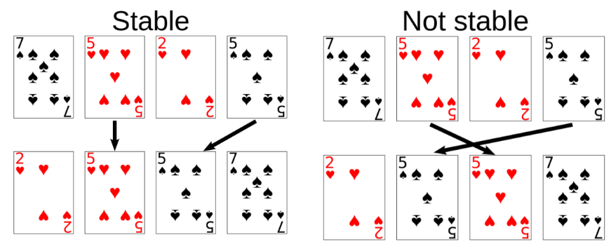

# Sortieren

## Ziele

- [ ] Ich kenne verschiedene Sortieralgorithmen und deren Unterschiede – insbesondere deren Vor- und Nachteile
- [ ] Ich weiss, welcher Sortieralgorithmus wann optimal eingesetzt werden kann
- [ ] Ich weiss, wie die Sortieralgorithmen implementiert werden können

## Übersicht

* Mehr als ¼ kommerziell verbrauchter Rechenzeit entfallen auf Sortiervorgänge
* Handling sortierter Daten ist meist einfacher (siehe binäre Suche)
* Verschiedene Sortierverfahren für verschiedene Einsatzgebiete
* stabile vs. instabile Verfahren
    * stabile Verfahren ändern die relative Reihenfolge von Elementen, die bezüglich der Ordnung äquivalent sind, nicht
    * instabile Verfahren garantieren obiges nicht
    * V.a. wichtig bei mehrfacher Sortierung.
    
Bsp: Personen werden alphabetisch nach Name sortiert. Anschliessend nach Geburtsdatum. Nun sollen Personen mit gleichem Geburtsdatum immer noch alphabetisch sortiert sein und ihre Reihenfolge nicht ändern.



### In-Place

* In-Place heisst, dass man keine neue Sequenz füllt, sondern in der alten die beteiligten Elemente vertauscht/rotiert. Man arbeitet also mit konstantem Speicheroverhead
    * Praxis: Man will i.d.R. einfach nur die Daten sortieren. Dabei spielt dann die unsortierte Oirginalmenge keine Rolle. Daraus folgt „ich benötige diese nicht im Speicher, also tue ich das auch nicht.“ - Ausnahme ist, wenn das Orginal bestehen bleiben muss.
        * Der Mehrspeicherverbrauch kann extreme Folgen bei größeren Datenmengen haben, d.h. gerade auch auf "kleinen" Systemen ist man froh, wenn die Daten in den Speicher passen. Da will man keine doppelten Daten unnützerweise im Speicher.
        * In-Place-Sortierungen tauschen nach unterschiedlichen Verfahren einzelne Elemente aus, was bedeutet, dass der Speicherverbrauch = Liste + 1 Element beträgt, was sich sehr gut skalieren lässt.
        * Ausserdem kostet das Allozieren/Freigeben zusätzlichen Speichers auch Zeit. Das ist zwar beim Sortieren das geringere Übel, aber u.U. eben nicht vernachlässigbar.

## BubbleSort

* Sehr einfach zu implementieren, jedoch im Worst Case O(n2)
* https://www.youtube.com/watch?v=qtXb0QnOceY
* Pseudocode:

```C#
Function Bubblesort(Array a) {
    while(swapped) { // as soon as they are no longer swapps
        // in one round, it is sorted
        swapped = false;
        for(i = 0; i < a.Length-1; i++) {
            if(a[i] > a[i+1]) {
                swap(i, i+1);
                swapped = true;
            }
        }
    }
}
```

### BubbleSort – optimierte Variante 🔴

???


## Weitere Sortieralgorithmen 🔴

* Mergesort
* Heapsort
* Shellsort
* Selectionsort
* Quicksort
* Introsort


### Sortieralgorithmus

### Sortierverfahren Vergleichstabelle

| Sortierverfahren       | Best-Case       | Average-Case    | Worst-Case     | Stabil | Zusätzlicher Speicherbedarf |
|------------------------|-----------------|-----------------|----------------|--------|-----------------------------|
| [Binary Tree Sort](Binary-Tree-Sort/Binary-Tree-Sort.md)       | O(n log(n))     | O(n log(n))     | O(n log(n))    | ja     | O(n)                        |
| Bubblesort             | O(n)            | O(n^2)          | O(n^2)         | ja     | O(1)                        |
| Bucketsort             | O(n)            | O(n)            | O(n^2)         | (ja) / nein | O(n)                    |
| Combsort               | O(n log(n))     | O(n^2)          | O(n^2)         | nein   | –                           |
| Gnomesort              | O(n)            | O(n^2)          | O(n^2)         | ja     | –                           |
| Heapsort               | O(n log(n))     | O(n log(n))     | O(n log(n))    | nein   | –                           |
| Insertionsort          | O(n)            | O(n^2)          | O(n^2)         | ja     | O(1)                        |
| Introsort              | O(n log(n))     | O(n log(n))     | O(n log(n))    | nein   | –                           |
| Merge Insertion        | O(n log(n))     | O(n log(n))     | O(n log(n))    | ja     | –                           |
| Mergesort              | O(n log(n))     | O(n log(n))     | O(n log(n))    | ja     | Implementierung auf verketteter Liste: in-place, übliche Implementierungen (auf Array): O(n), Es gibt in-place auf Array, jedoch dann Zeitkomplex. = n * (log n) * (log n) |
| Natural Mergesort      | O(n)            | O(n log(n))     | O(n log(n))    | ja     | –                           |
| Quicksort              | O(n log(n))     | O(n log(n))     | O(n^2)         | nein   | O(n log(n)), übliche Implementierungen benötigen meist mehr |
| Selectionsort          | O(n^2)          | O(n^2)          | O(n^2)         | nein   | –                           |
| Shakersort (Cocktailsort) | O(n)         | O(n^2)          | O(n^2)         | ja     | –                           |
| Shellsort              | O(n log(n)^2)   | O(n log(n)^2)   | O(n log(n)^2)  | nein   | –                           |
| Smoothsort             | O(n)            | O(n log(n))     | O(n log(n))    | nein   | –                           |
| Timsort                | O(n)            | O(n log(n))     | O(n log(n))    | ja     | –                           |
| Pigeonholesort         | O(N+n)          | –               | –              | ja     | –                           |
| OddEventsort           | O(n)            | O(n^2)          | ?              | –      | O(1)                        |
| Cyclesort              | O(n^2)          | O(n^2)          | O(n^2)         | nein   | O(n) total, O(1) mit Hilfsmittel |


