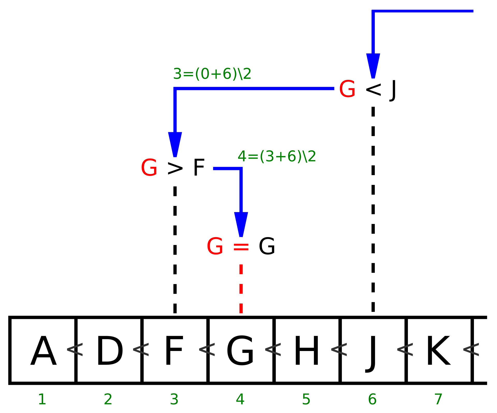

# Binary search

## Beschreibung
Die binäre Suche ist ein Algorithmus, der in einem Array sehr effizient ein gesuchtes Element entweder findet oder dessen Vorhandensein zuverlässig ausschließt. Voraussetzung ist, dass die Elemente in dem Array entsprechend einer totalen Ordnungsrelation angeordnet (sortiert) sind. Der Algorithmus basiert auf einer einfachen Form des Schemas „Teile und Herrsche“, zugleich stellt er auch einen Greedy-Algorithmus dar. Ordnung und spätere Suche müssen sich auf denselben Schlüssel beziehen: Beispielsweise kann in einem Telefonbuch, das nach Namen geordnet ist, mit binärer Suche nur nach einem bestimmten Namen gesucht werden, nicht jedoch z. B. nach einer bestimmten Telefonnummer. 

## Algorithmus

Aufgabe: In einem sortierten Array soll ein Suchwert gefunden werden.

Eingabe:

* Das zu durchsuchende Array, von links nach rechts mit aufsteigend sortierten Werten gefüllt. Die gleichen Werte dürfen mehrfach vorkommen.
* Der Suchwert.

Ausgabe:

* Wenn der Suchwert gefunden wurde, die Position des Suchwertes im Array.
* Wenn der Suchwert mehrmals im Array vorkommt, ist nicht festgelegt, welche der möglichen Positionen ausgegeben wird.
* Wenn der Suchwert nicht gefunden wurde, ein entsprechender Fehlercode, möglicherweise ergänzt durch die Position, an der der Suchwert stehen würde.

Ablauf:

1. Der Suchbereich umfasst anfangs das komplette Array.
2. Ist der Suchbereich leer, wurde der Suchwert nicht gefunden. Die Suche ist erfolglos beendet.
3. Die Mitte des Suchbereichs wird berechnet und der dort befindliche Wert mit dem Suchwert verglichen.
4. Ist der Suchwert gleich dem Vergleichswert, ist die Suche erfolgreich beendet. Die Position der Mitte wird ausgegeben.
5. Ist der Suchwert kleiner als der Vergleichswert, kann sich der Suchwert nur in der linken Hälfte befinden. Der rechte Rand des Suchbereichs wird auf die Position links von der Mitte eingeschränkt.
6. Ist der Suchwert größer als der Vergleichswert, kann sich der Suchwert nur in der rechten Hälfte befinden. Der linke Rand des Suchbereich wird auf die Position rechts von der Mitte eingeschränkt.
7. Die Suche wird mit dem verkleinerten Suchbereich ab Schritt 2 wiederholt.

Bei diesem Ablauf wird die Länge des Suchbereichs in jedem Schritt halbiert. Spätestens wenn der Suchbereich auf ein einzelnes Element geschrumpft ist, ist die Suche beendet. Dieses eine Element ist entweder das gesuchte Element, oder das gesuchte Element kommt nicht vor; dann ist als Ergebnis bekannt, wohin es einsortiert werden müsste.

Der Algorithmus zur binären Suche kann mittels Iteration oder Rekursion implementiert werden. Um ihn verwenden zu können, müssen die Daten bereits sortiert und in einer Datenstruktur vorliegen, in der direkt auf das n-te Element zugegriffen werden kann. Auf einer einfachen verketteten Liste würde die Effizienz verloren gehen (siehe aber Skip-Liste). 

## Beispiel



Angenommen, in nebenstehender alphabetisch sortierter Liste von 13 Buchstaben möchte man wissen, ob der Buchstabe G in dieser Liste enthalten ist und an welcher Position er steht oder stehen müsste.

Hierzu prüft man zunächst das mittlere Element der Liste. Mittlere Position ist 13 ∖ 2 = 6 (' ∖ ' ist Division mit Rest, hier: Teilen und Abrunden), es wird das Element an Position 6 mit dem gesuchten G verglichen. Dort findet man den Wert J. Da im Alphabet G vor J steht (also G kleiner als J ist) und die Liste ja sortiert ist, muss der Suchwert G im Bereich vor Position 6 stehen.

Das macht man nun rekursiv: Man durchsucht nicht den ganzen verbleibenden Bereich, sondern prüft wieder nur das Element in dessen Mitte, hier also das Element an der Position 6 ∖ 2 = 3. Dort steht der Wert F. Da G größer als F ist, muss man im Bereich hinter dem F weitersuchen, jedoch vor dem J. Das heißt: man muss im Bereich zwischen Element 3 und Element 6 suchen.

Nun greift man wieder „in die Mitte“ dieses Bereiches zwischen F und J, an Position ( Position ( F ) + Position ( J ) ) ∖ 2 = 4. Dort finden wir nun das gesuchte Element G.

Wäre stattdessen der Suchwert I gewesen, dann hätte noch der Bereich zwischen G und J geprüft werden müssen. Dort ist H kleiner I; zwischen H und J verbleibt aber kein Bereich mehr, somit ist in dieser Liste kein I enthalten. Als Ergebnis kann der Algorithmus nur liefern, dass I hinter Position 5 einzusortieren wäre.

Die binäre Suche ist effizient: Von den insgesamt 13 Buchstaben mussten wir nur 3 Buchstaben vergleichen, bis wir den gesuchten Buchstaben G gefunden hatten. Auch im schlechtesten Fall hätten wir nur 4 Buchstaben vergleichen müssen.

Ein naiver Algorithmus würde hingegen einfach die ganze Liste von vorne nach hinten durchgehen und müsste somit im ungünstigsten Fall bis zu 13 Elemente untersuchen (wenn der Suchwert Z wäre, das ganz am Ende der Liste steht oder gar nicht in der Liste enthalten ist).

Mit binärer Suche kann man also die Anzahl der benötigten Vergleiche stark verringern. Dieser Vorteil fällt umso stärker ins Gewicht, je größer die zu durchsuchende Liste ist. 

## Komplexität

Um in einem Array mit n Einträgen die An- oder Abwesenheit eines Schlüssels festzustellen, werden maximal ⌈ log_{2} ⁡ ( n + 1 ) ⌉ = ⌊ log_{2} ⁡ ( n ) + 1 ⌋ Vergleichsschritte benötigt. Somit hat die binäre Suche in der Landau-Notation ausgedrückt die Zeitkomplexität O ( log ⁡n ). Damit ist sie deutlich schneller als die lineare Suche, welche allerdings den Vorteil hat, auch in unsortierten Arrays zu funktionieren. In Spezialfällen kann die Interpolationssuche schneller sein als die binäre Suche. 

## Implementeriung

```C#
using System;

class Program
{
    static void Main()
    {
        int[] sortedArray = { 1, 3, 5, 7, 9, 11, 13, 15, 17, 19 };
        int target = 7;

        int index = BinarySearch(sortedArray, target);

        if (index != -1)
        {
            Console.WriteLine($"Element {target} gefunden an Index {index}.");
        }
        else
        {
            Console.WriteLine($"Element {target} nicht gefunden.");
        }
    }

    static int BinarySearch(int[] array, int target)
    {
        int left = 0;
        int right = array.Length - 1;

        while (left <= right)
        {
            int mid = left + (right - left) / 2;

            // Überprüfen, ob das Ziel das mittlere Element ist
            if (array[mid] == target)
            {
                return mid; // Ziel gefunden
            }

            // Wenn das Ziel größer ist, ignoriere die linke Hälfte
            if (array[mid] < target)
            {
                left = mid + 1;
            }
            // Wenn das Ziel kleiner ist, ignoriere die rechte Hälfte
            else
            {
                right = mid - 1;
            }
        }

        // Ziel nicht gefunden
        return -1;
    }
}
```

### Python
Python Code
```Python
def binäre_suche(folge: Sequence[int], x: int) -> Tuple[str, int]:
    links = 0
    rechts = len(folge) - 1

    while links <= rechts:
        mitte = links + (rechts - links) // 2  # Bereich halbieren
        if folge[mitte] == x: 
            return 'Position', mitte

        if folge[mitte] > x:
            rechts = mitte - 1  # im linken Abschnitt weitersuchen
        else:
            links = mitte + 1  # im rechten Abschnitt weitersuchen

    return 'Lücke', links
```