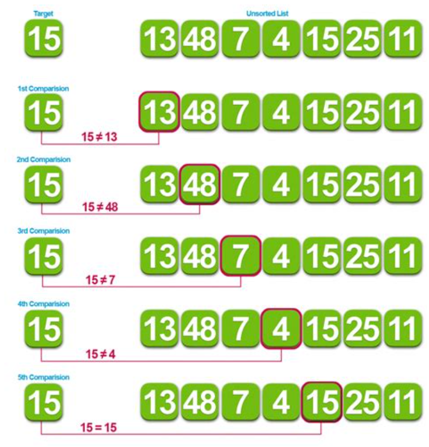
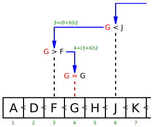
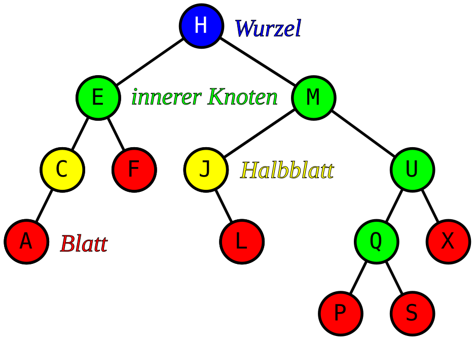
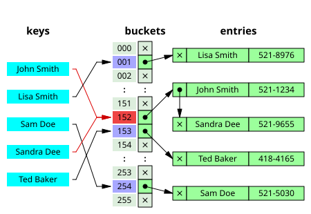

# Suche

## Searching algorithms

| Algorithm            | Best    | Average  | Worst   | Stabile | Worst-case space complexity |
|----------------------|---------|----------|---------|---------|-----------------------------|
| Linear search        | O(1)    | O(n)     | O(n)    |         | O(1) iterative              |
| Binary search array  | O(1)    | O(log n) | O(log n)|         | O(1)                        |
| Binary search tree   | O(1)    | O(log n) | O(n)    |         |                             |
| Hashing              | O(1)    | O(1)     | O(n)    |         |                             |

### Linear search 
Lineare Suche ist ein Algorithmus, der auch unter dem Namen sequentielle Suche bekannt ist. Er ist der einfachste Suchalgorithmus überhaupt.
Die Aufgabe besteht darin, ein Element in einer Liste oder einem Array mit n Elementen zu finden. Man geht dazu die Liste Element für Element durch, bis man es gefunden hat. Der Suchaufwand wächst linear mit der Anzahl der Elemente in der Liste.
Die effizientere Binäre Suche kann nur bei geordneten Listen benutzt werden.
Für ungeordnete Listen existiert mit Lazy Select noch ein randomisierter Algorithmus, der mit relativ hoher Wahrscheinlichkeit das x-te Element einer Liste bezüglich einer Ordnung schneller als in linearer Zeit finden kann.

### Binary search
Die binäre Suche ist ein Algorithmus, der auf einem Feld (also meist „in einer Liste“) sehr effizient ein gesuchtes Element findet bzw. eine zuverlässige Aussage über das Fehlen dieses Elementes liefert. Voraussetzung ist, dass die Elemente in dem Feld entsprechend einer totalen Ordnungsrelation angeordnet (sortiert) sind. Der Algorithmus basiert auf einer einfachen Form des Schemas „Teile und Herrsche“, zugleich stellt er auch einen Greedy-Algorithmus dar. Ordnung und spätere Suche müssen sich auf denselben Schlüssel beziehen – beispielsweise kann in einem Telefonbuch, das nach Namen geordnet ist, mit binärer Suche nur nach einem bestimmten Namen gesucht werden, nicht jedoch z. B. nach einer bestimmten Telefonnummer. 

### Binary search tree 
In der Informatik ist ein binärer Suchbaum eine Kombination der abstrakten Datenstrukturen Suchbaum und Binärbaum. Ein binärer Suchbaum, häufig abgekürzt als BST (von englisch Binary Search Tree), ist ein binärer Baum, bei dem die Knoten „Schlüssel“ tragen, und die Schlüssel des linken Teilbaums eines Knotens nur kleiner (oder gleich) und die des rechten Teilbaums nur größer (oder gleich) als der Schlüssel des Knotens selbst sind.
Was die Begriffe „kleiner gleich“ und „größer gleich“ bedeuten, ist völlig dem Anwender überlassen; sie müssen nur eine Totalordnung (genauer: eine totale Quasiordnung siehe unten) etablieren. Am flexibelsten wird die Ordnungsrelation durch eine vom Anwender zur Verfügung zu stellende 3-Wege-Vergleichsfunktion realisiert. Auch ob es sich um ein einziges Schlüsselfeld oder eine Kombination von Feldern handelt, ist Sache des Anwenders; ferner ob Duplikate (unterschiedliche Elemente, die beim Vergleich aber nicht als „ungleich“ herauskommen) zulässig sein sollen oder nicht. Über Suchfunktionen für diesen Fall siehe unten.
Ein in-order-Durchlauf durch einen binären Suchbaum ist äquivalent zum Wandern durch eine sortierte Liste (bei im Wesentlichen gleichem Laufzeitverhalten). Mit anderen Worten: ein binärer Suchbaum bietet ggf. wesentlich mehr Funktionalität (zum Beispiel Durchlauf in der Gegenrichtung und/oder einen „direkten Zugriff“ mit potentiell logarithmischem Laufzeitverhalten – erzielt durch das Prinzip „Teile und herrsche“, das auf der Fernwirkung des Transitivitätsgesetzes beruht) bei einem gleichen oder nur unwesentlich höheren Speicherbedarf.

### Hashing
In der Informatik bezeichnet man eine spezielle Indexstruktur als Hashtabelle (englisch hash table oder hash map) bzw. Streuwerttabelle. Sie wird verwendet, um Datenelemente in einer großen Datenmenge zu suchen bzw. aufzufinden (Hash- oder Streuspeicherverfahren).
Gegenüber alternativen Index-Datenstrukturen wie Baumstrukturen (z. B. ein B+-Baum) oder Skip-Listen zeichnen sich Hashtabellen üblicherweise durch einen konstanten Zeitaufwand bei Einfüge- bzw. Entfernen-Operationen aus.

