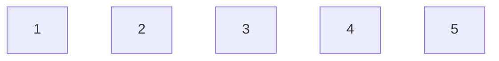
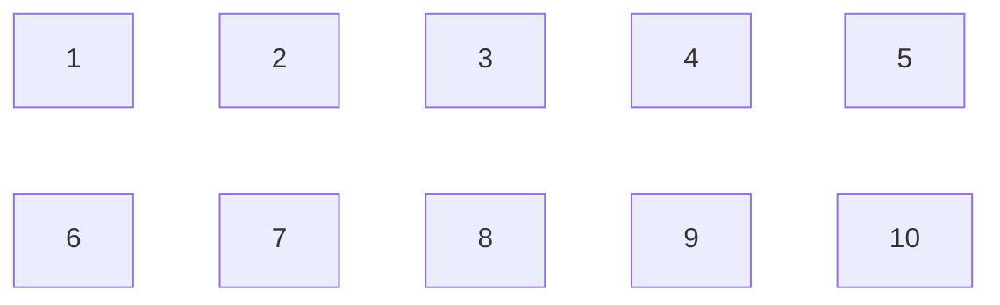
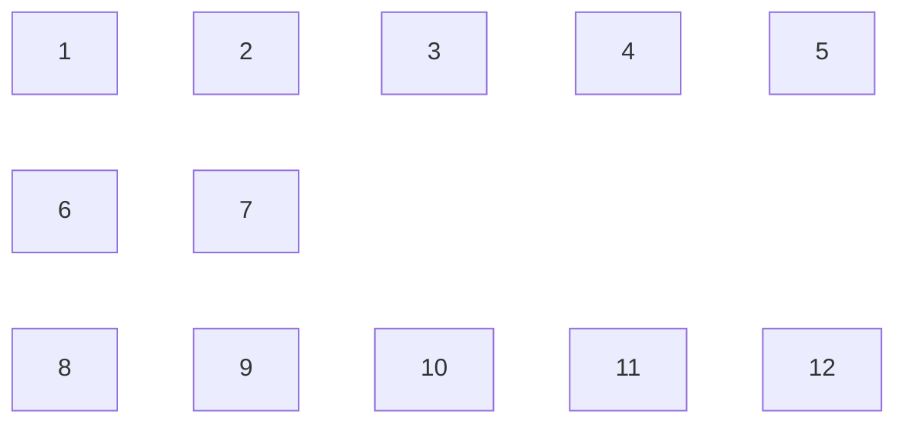
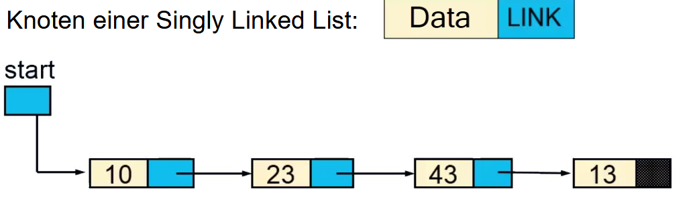
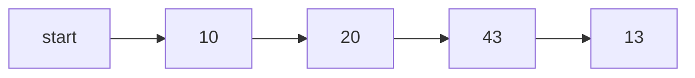
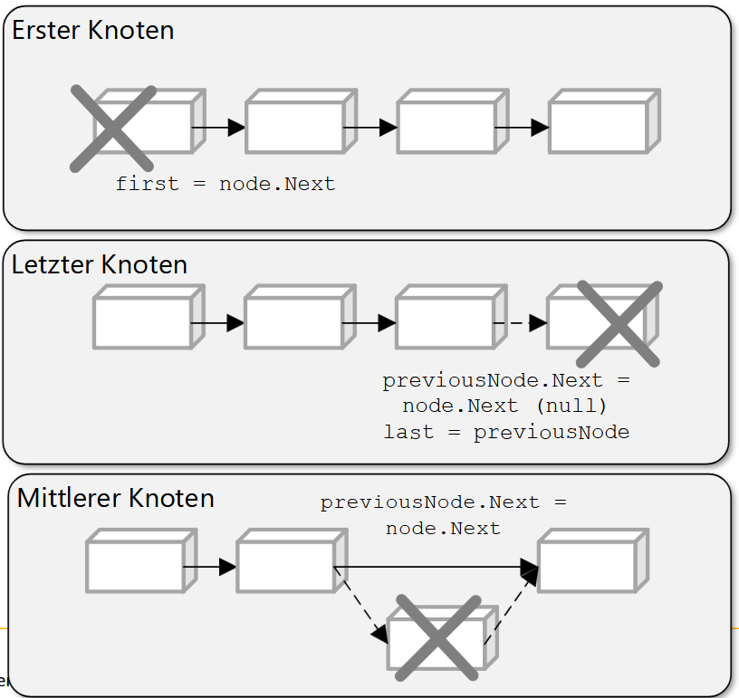
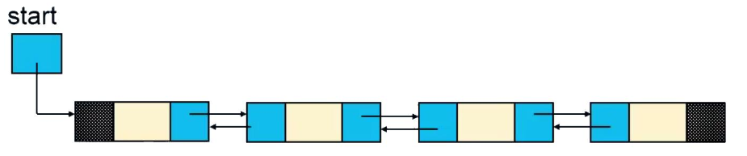

---
tags:
  - MD03
  - List
  - Datensturkturen
---

# List

- [ ] Ich weiss, was unter «Lineare Datenstruktur» verstanden wird
- [ ] Ich kennen die Unterschiede zwischen einem Array und einer dynamischen Liste
- [ ] Ich weiss, wie Sie eine List implementieren können

## Ziel

* Lineare Datenstruktur
    * ordnet die Elemente sequentiell an
    * es kann nur ein Element direkt angesprochen werden
    * Bsp: Array, LinkedList
* Nicht-Lineare Datenstruktur
    * keine sequentielle Struktur
    * jedes Element ist mit mehreren anderen Elementen verbunden
    * die Verbindung ist spezifisch zur abgebildeten Beziehung
    * Bsp: Tree, Graph


## Array

* Einfachster Typ einer Datenstruktur
* Eine Sammlung von aufeinanderfolgenden Elementen
* Speicherung in aufeinanderfolgenden Speicherbereichen
* Jedes Element hat den gleichen Datentyp
* Arraytypen
    * Eindimensionale Arrays
    * Multidimensionale Arrays
    * Jagged
* Anzahl Dimensionen und die Länge jeder Dimension werden bei der Erstellung festgelegt und können nicht geändert werden

### Eindimensionales Array
```C#
int[] array = new int[5];
```




### Multidimensionales Array
```C#
int[,] array = new int[2, 4];
int[,,] array1 = new int[2, 4, 3];
```



### Jagged Array
```C#
int[][] jaggedArray = new int[3][];
jaggedArray[0] = new int[5];
jaggedArray[1] = new int[2];
jaggedArray[2] = new int[4];
```



### Nachteile von Array?

* Limitiert bzw. können nicht mehr geändert werden

## Singly Linked List (einfach verkettete Liste)

* Dynamische Datenstruktur bestehend aus Knoten
* Daten werden nicht in aufeinanderfolgenden Speicherbereichen gespeichert
* Einfügen und Löschen von Elementen ist einfacher als in Arrays
    * Keine Neuerstellung und umkopieren nötig
* Kann für die Implementierung von List, Stack, Queue verwendet werden



Knoten einer Singly Linked List: Data|Link

Start --> 10|Link --> 23|Link --> 43|Link --> 23|End



### Implementierung

#### Konten

```C#
private sealed class Node {
    public object Data { get; set; }
    public Node Link { get; set; }
}
```

Welche Methoden und Eigenschaften sollen für die Linked List implementiert werden?

```C#
public void Add(Object item)
public bool Contains(Object item)
public bool Remove(Object item)
public bool FindByIndex(int index)
public int Count { get; }
```

#### Add-Methode

```c#
public void Add(object data)
```

1. Neuen Knoten instanziieren
2. Überprüfen, ob es sich um den ersten Knoten handelt
3. Ermitteln des letzten Knotens in der Liste
4. Next-Eigenschaft des letzten Knotens auf neuen Knoten setzen

#### Contains-Methode

```c#
public bool Contains(object data)
{
    return Find(data) != null;
}
```

#### Remove-Methode

```c#
public bool Remove(object data)
```




#### Find-Methode
```c#
public bool FindByIndex(int index)
```

#### Exkurs «Indexer»
Zugriff auf Elemente in einer Klasse über einen Index wie bei einem Array

Deklaration:

```C#
public object this[int index] {
    get {
        …
    }
    set {
        …
    }
}
```

## Doubly Linked List (doppelt verkettete Liste)



Start --> -|Data|Link --> PrevLink|Data|Link --> PrevLink|Data|Link --> PrevLink|Data|-

Vorteile:

* Können in beide Richtungen traversiert werden
* Implementierung wird einfacher: Einfügen und Löschen

Nachteile

* Zusätzlicher Speicher
* Es muss eine zusätzliche Referenz verwaltet werden


### Implementierung

* Knoten

```C#
private sealed class Node {
    public object Data { get; set; }
    public Node Link { get; set; }
    public Node PrevLink { get; set; }
}
```

## Liste über Array
* Vorteil
    * direkter Zugriff auf Element: Laufzeit O(1)

* Nachteil
    * statische Grösse
    * Lösung
        * Methode zum Vergrössern/Verkleinern des Arrays
        * kostet Zeit
        * daher nicht bei jedem Einfügen/Löschen

### System.Collections.ArrayList (1)

```C#
public virtual int Add(Object value) {
    Contract.Ensures(Contract.Result<int>() >= 0);
    if (_size == _items.Length) EnsureCapacity(_size + 1);
    _items [_size] = value;
    _version++;
    return _size++;
}

private void EnsureCapacity(int min) {
    if (_items. Length < min) {
        int newCapacity = _items.Length == 0? defaultCapacity: _items.Length * 2;
        // Allow the list to grow to maximum possible capacity (~2G elements) before encountering overflow.
        // Note that this check works even when _items. Length overflowed thanks to the (uint) cast
        if ((uint)newCapacity > Array.MaxArrayLength) newCapacity = Array.MaxArrayLength;
        if (newCapacity < min) newCapacity = min;
        Capacity = newCapacity;
    }
}
```

### System.Collections.ArrayList (2)

```C#
public virtual int Capacity {
    get {
        Contract.Ensures(Contract.Result<int>() >= Count);
        return _items.Length;
    }

    set {
        if (value < size) {
            throw new ArgumentOutOfRangeException("value", Environment.GetResourceString("ArgumentOutOfRange_SmallCapacity"));
        }
        Contract.Ensures(Capacity >= 0);
        Contract. EndContractBlock();
        // We don't want to update the version number when we change the capacity.
        // Some existing applications have dependency on this.
        if (value != items.Length) {
            if (value > 0) {
                Object[] newItems = new Object[value];
                if (size > 0) {
                    Array.Copy(_items, 0, newItems, 0, _size);
                }
                _items = newItems;
            else {
                items = new Object[_defaultCapacity];
            }
        }
}
```

### System.Collections.ArrayList (3)
```C#
// Removes the element at the given index. The size of the list is
// decreased by one.

public virtual void RemoveAt(int index) {
    if (index < 0 | | index >= size) throw new ArgumentOutOfRangeException("index", |
    Contract. Ensures(Count >= 0);
    //Contract.Ensures(Count == Contract.OldValue(Count) - 1);
    Contract. EndContractBlock();

    _size--;
    if (index < _size) {
        Array. Copy(_items, index + 1, items, index, _size - index);
    }
    _items [_size] = null;
    _version++;
}
```

## Vergleich ArrayList - LinkedList

| Methode | Komplexitäts-Klasse | Hinweise |
| ------- | ------------------- | --------- |
| ArrayList.Add | O(1) | bei Vergrößerung des Arrays: O(n) |
| LinkedList.Add | O(1) |


## Selbststudium

* Lesen Sie Kapitel 2.2 in Cordts2023
    * SinglyLinkedList: S.25 – 2
        * Bearbeiten Sie das Beispiel «Rechtschreibeprüfung»
        * Implementieren Sie die Klasse SinglyLinkedListEnumerator
            * Studieren Sie dazu das Interface IEnumverator
            * Studieren Sie das Schlüsselwort yield
        *Ändern Sie die Klasse Klasse SinglyLinkedList so, dass generische Typen verwendet werden können
    * DoublyLinkedList: S. 43 – 49
    * ArrayList: S. 49 - 53
* Lösen Sie die Übungsaufgaben zu Kapitel 2.2