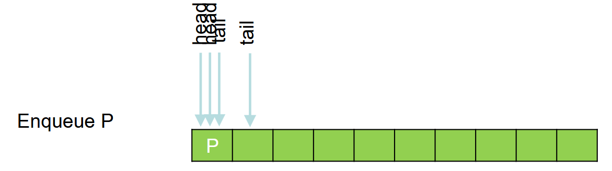
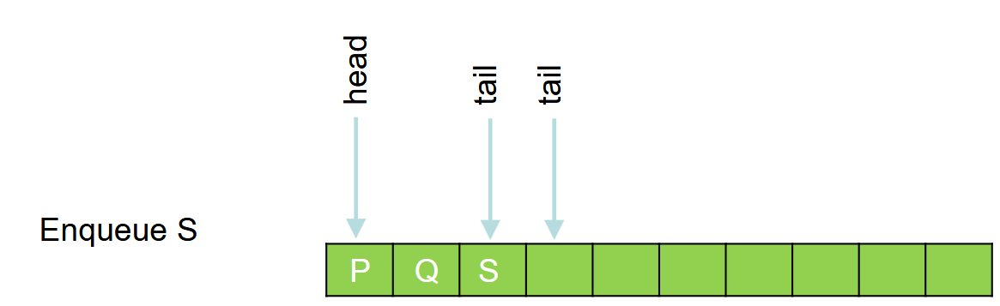
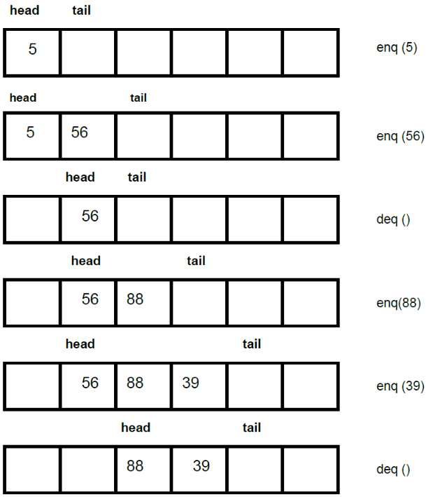
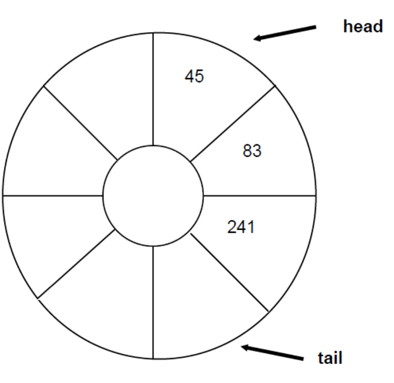

---
tags:
  - Queue
  - FIFO-Speicher
hide:
  #- navigation
  #- toc
---

# Queue

## Ziele

- [ ] Ich weiss, was eine Queue ist
- [ ] Ich kennen den Unterschied einer Queue zu einer Liste
- [ ] Ich weiss, wie Sie eine Queue implementieren können

## Definition Queue

* Deutsch: Warteschlange, FIFO-Speicher
* Ablegen der Elemente erfolgt von oben und Entnahme von unten, d.h. die Elemente, die zuletzt eingefügt wurden, werden als letzte wieder entnommen (First-in-First-out).


### Beispiel

* In der Praxis treten Queues in verschiedensten Anwendungen auf. So kann diese Datenstruktur als Buffer beim Informationsaustausch zwischen asynchron laufenden Prozessen verwendet werden.

### Funktionsweise

* Einfügen: Enqueue (tail)
* Löschen: Dequeue (head)







### Implementierung

* Welche Methoden und Eigenschaften sollen für eine Queue implementiert werden?

```C#
public void Enqueue(T item)
public T Dequeue()
public T Peek()
public void Clear()
public int Count
```

* Implementierung als
    * Array
    * SinglyLinkedList

#### Implementierung als Array

* Es ist zu beachten, dass sich bei mehreren enq() - und deq() - Zugriffen auf die Queue, die Indexzeiger head und tail immer nach oben (grössere Index) bewegen. Das heisst, die Schlange bewegt sich rückwärts durch das ganze Array





## Selbststudium

* Lesen Sie Kapitel 2.4 in Cordts2023, Lösen Sie die Aufgaben zum Kapitel
* Bearbeiten Sie das Beispiel in Cordts2023 (Beachten Sie auch die Quellcodes zum Buch – siehe Slides «Einführung»):
    * Webserver (S. 76ff)