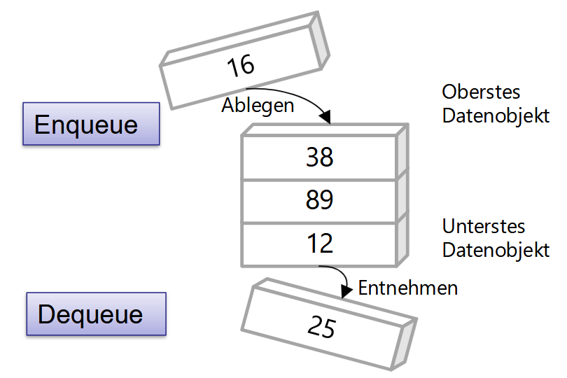
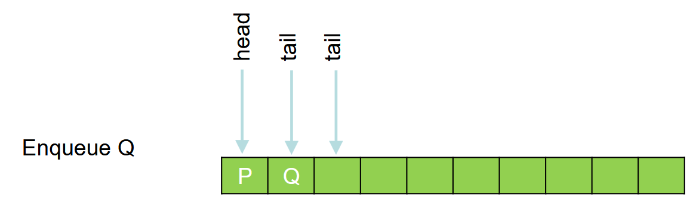
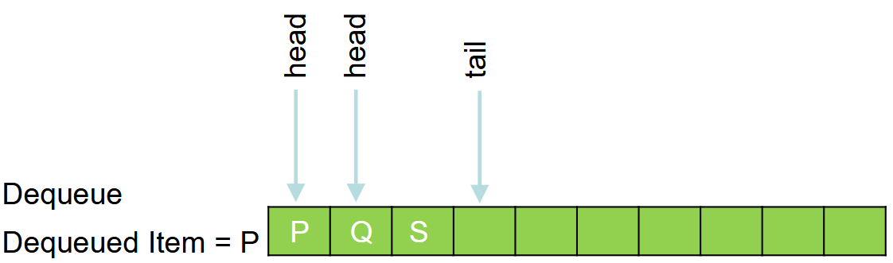
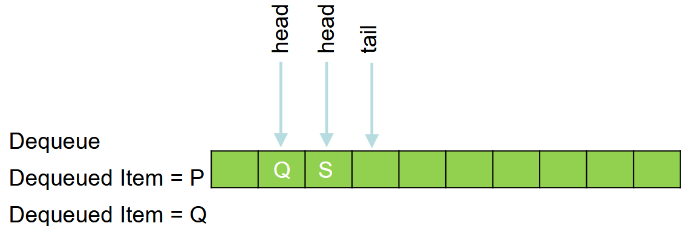

---
tags:
  - Queue
  - FIFO-Speicher
hide:
  #- navigation
  #- toc
---

# Queue

## Ziele

- [ ] Ich weiss, was eine Queue ist
- [ ] Ich kennen den Unterschied einer Queue zu einer Liste
- [ ] Ich weiss, wie eine Queue implementiert wird

## Definition Queue

* Deutsch: Warteschlange, FIFO-Speicher
* Ablegen der Elemente erfolgt von oben und Entnahme von unten, d.h. die Elemente, die zuletzt eingefügt wurden, werden als letzte wieder entnommen (First-in-First-out).




### Beispiel

* In der Praxis treten Queues in verschiedensten Anwendungen auf. So kann diese Datenstruktur als Buffer beim Informationsaustausch zwischen asynchron laufenden Prozessen verwendet werden.

### Funktionsweise

* Einfügen: Enqueue (tail)
* Löschen: Dequeue (head)










### Implementierung

* Welche Methoden und Eigenschaften sollen für eine Queue implementiert werden?

```C#
public void Enqueue(T item)
public T Dequeue()
public T Peek()
public void Clear()
public int Count
```

* Implementierung als
    * Array
    * SinglyLinkedList

#### Implementierung als Array

* Es ist zu beachten, dass sich bei mehreren enq() - und deq() - Zugriffen auf die Queue, die Indexzeiger head und tail immer nach oben (grössere Index) bewegen. Das heisst, die Schlange bewegt sich rückwärts durch das ganze Array


## Selbststudium

* Lesen Sie Kapitel 2.4 in Cordts2023, Lösen Sie die Aufgaben zum Kapitel
* Bearbeiten Sie das Beispiel in Cordts2023 (Beachten Sie auch die Quellcodes zum Buch – siehe Slides «Einführung»):
    * Webserver (S. 76ff)

## Was ist der Unterschied einer Queue zu einer Liste?

Der Hauptunterschied zwischen einer Queue (Warteschlange) und einer Liste liegt in der Art und Weise, wie Elemente hinzugefügt und entfernt werden.

* Queue (Warteschlange):
  * FIFO-Prinzip: Eine Queue arbeitet nach dem "First In, First Out"-Prinzip. Das bedeutet, dass das erste Element, das hinzugefügt wird, auch das erste ist, das entfernt wird.
  * Operationen: Die grundlegenden Operationen sind enqueue (ein Element hinzufügen) und dequeue (ein Element entfernen). Man kann nur am Ende der Queue Elemente hinzufügen und am Anfang entfernen.

* Liste:
  * Flexibilität: Eine Liste ist flexibler und erlaubt das Hinzufügen und Entfernen von Elementen an beliebigen Positionen. Man kann Elemente am Anfang, Ende oder an einer bestimmten Stelle in der Liste hinzufügen oder entfernen.
  * Zugriff: In einer Liste kann man auf Elemente über ihren Index zugreifen, was bei einer Queue nicht der Fall ist, da man nur das vorderste Element direkt entfernen kann.

Zusammenfassend lässt sich sagen, dass eine Queue eine spezielle Art von Datenstruktur ist, die für bestimmte Anwendungen wie Warteschlangenmanagement oder Aufgabenverwaltung nützlich ist, während eine Liste eine allgemeinere Datenstruktur ist, die mehr Flexibilität bietet.

## Implementierung

```C#
using System;
using System.Collections.Generic;

public class Queue<T>
{
    private LinkedList<T> _items = new LinkedList<T>();

    // Fügt ein Element am Ende der Warteschlange hinzu
    public void Enqueue(T item)
    {
        _items.AddLast(item);
    }

    // Entfernt und gibt das Element am Anfang der Warteschlange zurück
    public T Dequeue()
    {
        if (_items.Count == 0)
        {
            throw new InvalidOperationException("Die Warteschlange ist leer.");
        }

        T value = _items.First.Value;
        _items.RemoveFirst();
        return value;
    }

    // Gibt das Element am Anfang der Warteschlange zurück, ohne es zu entfernen
    public T Peek()
    {
        if (_items.Count == 0)
        {
            throw new InvalidOperationException("Die Warteschlange ist leer.");
        }

        return _items.First.Value;
    }

    // Löscht alle Elemente aus der Warteschlange
    public void Clear()
    {
        _items.Clear();
    }

    // Gibt die Anzahl der Elemente in der Warteschlange zurück
    public int Count
    {
        get { return _items.Count; }
    }
}

// Beispiel zur Verwendung der Queue
public class Program
{
    public static void Main()
    {
        Queue<int> queue = new Queue<int>();
        
        queue.Enqueue(1);
        queue.Enqueue(2);
        queue.Enqueue(3);
        
        Console.WriteLine("Erstes Element: " + queue.Peek()); // Gibt 1 aus
        Console.WriteLine("Anzahl der Elemente: " + queue.Count); // Gibt 3 aus
        
        Console.WriteLine("Entferntes Element: " + queue.Dequeue()); // Gibt 1 aus
        Console.WriteLine("Anzahl der Elemente nach Dequeue: " + queue.Count); // Gibt 2 aus
        
        queue.Clear();
        Console.WriteLine("Anzahl der Elemente nach Clear: " + queue.Count); // Gibt 0 aus
    }
}
```

### Implementierung als Array

```C#
using System;

public class ArrayQueue<T>
{
    private T[] _items;
    private int _head;
    private int _tail;
    private int _count;

    public ArrayQueue(int capacity)
    {
        _items = new T[capacity];
        _head = 0;
        _tail = 0;
        _count = 0;
    }

    public void Enqueue(T item)
    {
        if (_count == _items.Length)
            throw new InvalidOperationException("Queue is full.");

        _items[_tail] = item;
        _tail = (_tail + 1) % _items.Length;
        _count++;
    }

    public T Dequeue()
    {
        if (_count == 0)
            throw new InvalidOperationException("Queue is empty.");

        T item = _items[_head];
        _items[_head] = default(T); // Optional: Clear the reference
        _head = (_head + 1) % _items.Length;
        _count--;
        return item;
    }

    public T Peek()
    {
        if (_count == 0)
            throw new InvalidOperationException("Queue is empty.");

        return _items[_head];
    }

    public void Clear()
    {
        Array.Clear(_items, 0, _items.Length);
        _head = 0;
        _tail = 0;
        _count = 0;
    }

    public int Count => _count;
}
```

### Implementierung als Singly Linked List

```C#
using System;

public class Node<T>
{
    public T Value;
    public Node<T> Next;

    public Node(T value)
    {
        Value = value;
        Next = null;
    }
}

public class SinglyLinkedListQueue<T>
{
    private Node<T> _head;
    private Node<T> _tail;
    private int _count;

    public SinglyLinkedListQueue()
    {
        _head = null;
        _tail = null;
        _count = 0;
    }

    public void Enqueue(T item)
    {
        Node<T> newNode = new Node<T>(item);
        if (_tail != null)
        {
            _tail.Next = newNode;
        }
        _tail = newNode;
        if (_head == null)
        {
            _head = _tail;
        }
        _count++;
    }

    public T Dequeue()
    {
        if (_head == null)
            throw new InvalidOperationException("Queue is empty.");

        T value = _head.Value;
        _head = _head.Next;
        if (_head == null)
        {
            _tail = null; // Queue is now empty
        }
        _count--;
        return value;
    }

    public T Peek()
    {
        if (_head == null)
            throw new InvalidOperationException("Queue is empty.");

        return _head.Value;
    }

    public void Clear()
    {
        _head = null;
        _tail = null;
        _count = 0;
    }

    public int Count => _count;
}
```