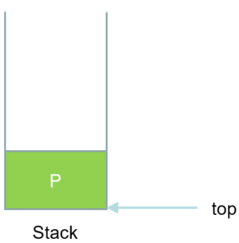
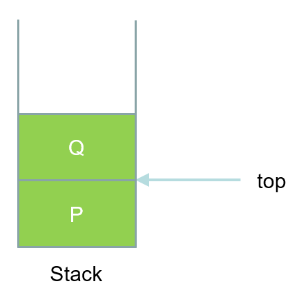
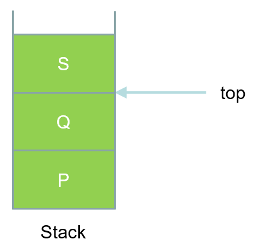
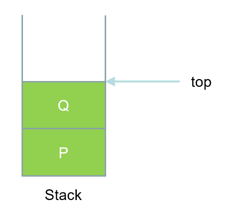
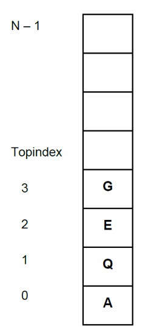
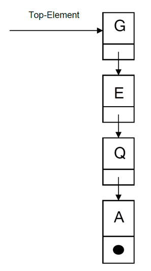

---
tags:
  - Stack
hide:
  #- navigation
  #- toc
---

# Stack

## Definition Stack

* Deutsch: Stapel, Keller, LIFO-Speicher (Last-in-First-out)
* Ablegen und Entnahme der Elemente von oben, d.h. die Elemente, die zuletzt eingefügt wurden, werden als nächstes wieder entnommen (Last-in-First-out).

## Beispiel

* Türme von Hanoi
* Tellerstabel
* 

## Funktionsweise

Zeichnung mit mermaid

### Ablauf 1

* Einfügen: Push
* Löschen: Pop

Push P



### Ablauf 2

Push Q



### Ablauf 3

Push S


### Ablauf 4

Pop

Popped Item = S



### Ablauf 5

Pop

Popped Item = S

Popped Item = Q



## Implementierung

* Welche Methoden und Eigenschaften sollen für einen Stack implementiert werden?

```C#
public void Push(T item)
public T Pop()
public T Peek()
public void Clear()
public int Count
```

```C#
public class Stack<T>
{
    private List<T> elements = new List<T>();

    public void Push(T item)
    {
        elements.Add(item);
    }

    public T Pop()
    {
        if (elements.Count == 0) throw new InvalidOperationException("Stack is empty.");
        T item = elements[elements.Count - 1];
        elements.RemoveAt(elements.Count - 1);
        return item;
    }

    public T Peek()
    {
        if (elements.Count == 0) throw new InvalidOperationException("Stack is empty.");
        return elements[elements.Count - 1];
    }

    public void Clear()
    {
        elements.Clear();
    }

    public int Count
    {
        get { return elements.Count; }
    }
}
```


* Implementierung als
    * Array
    * SinglyLinkedList

### Implementierung als Array



### Implementierung als SinglyLinkedList



## Spezialfälle

* Beim Stack müssen üblicherweise zwei Spezialfälle näher betrachtet werden:
    * Overflow:
        * Der Stack überläuft – d.h. das Array hat keinen Platz mehr. Entweder wird das Array vergrössert oder der 	Aufrufer erhält eine Fehlermeldung und die Operation Push() wird abgebrochen
    * Underflow:
        * Es wird auf einen leeren Stack die Operation Pop() ausgeführt. Der Aufrufer erhält eine Fehlermeldung und die Operation Pop() wird abgebrochen.

## Selbststudium

* Lesen Sie Kapitel 2.3 in Cordts2023, Lösen Sie die Aufgaben zum Kapitel
* Bearbeiten Sie die Beispiele in Cordts2023 (Beachten Sie auch die Quellcodes zum Buch – siehe Slides «Einführung»):
    * PostScript (S. 58ff)
    * FloodFill-Algorithmus (S. 62ff)